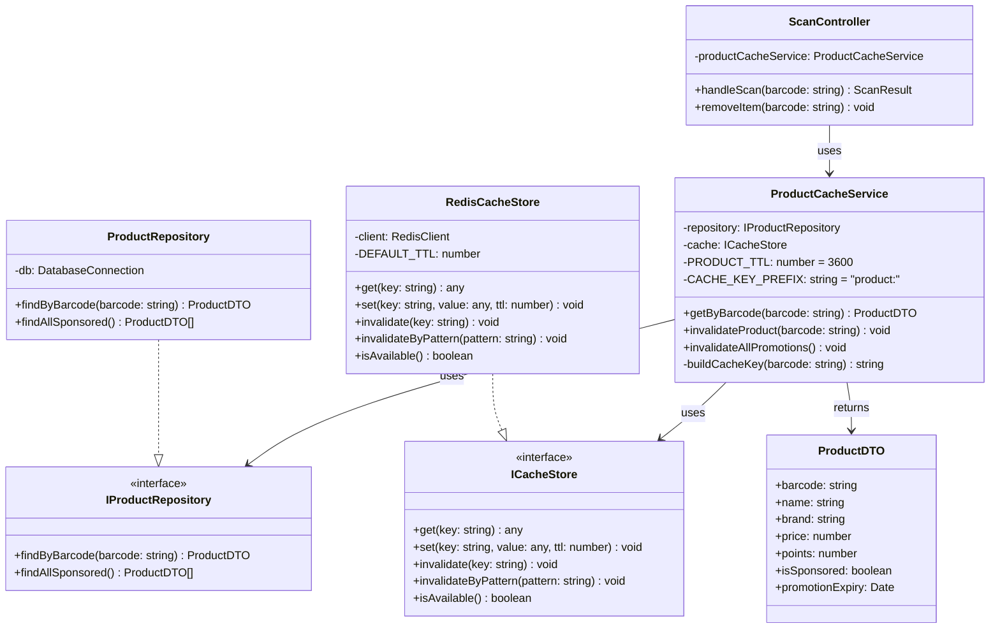
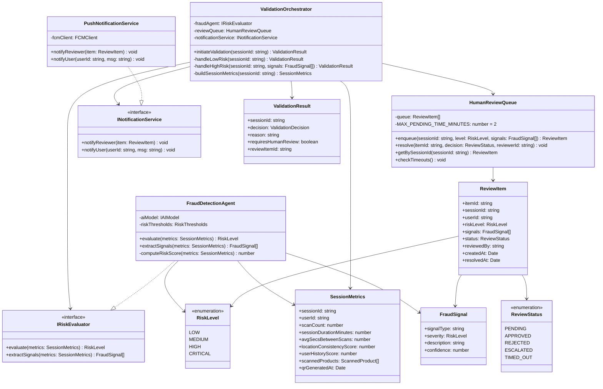

# SmartCart — Patrones de Diseño Aplicados

Patrones seleccionados del catálogo GoF que resuelven problemas reales en el contexto de SmartCart. Cada entrada especifica la funcionalidad, los actores involucrados y el rol que cumple el patrón.

---

## Observer — Actualización de estado tras escaneo

**Funcionalidad**: Al escanear un producto, múltiples componentes deben reflejar el cambio de forma inmediata y desacoplada.

**Actores**:
- `ScannerService` (Subject): detecta escaneo exitoso y notifica
- `PointsCardComponent` (Observer): actualiza puntos pendientes en la tarjeta
- `ProductListComponent` (Observer): agrega el producto a la lista escaneada
- `ToastComponent` (Observer): muestra confirmación verde al usuario
- `SessionStateManager` (Observer): actualiza estado interno de la sesión

**Por qué**: evita que el Scanner conozca a todos los componentes; cada Observer se suscribe y reacciona independientemente.

---

## State — Estados de la sesión de compra

**Funcionalidad**: La sesión de compra tiene estados discretos que determinan qué acciones y qué UI son válidas en cada momento.

**Actores**:
- `ShoppingSession` (Context): delega comportamiento al estado activo
- `EmptyState`: CTA "Escanear producto", sin lista de productos
- `ScanningState`: cámara activa, espera lectura de código de barras
- `WithProductsState`: lista de productos visible, dual CTA (escanear otro / generar QR)
- `ValidatingState`: QR visible, polling al POS, sin acciones del usuario
- `ConfirmedState`: pantalla de confirmación, puntos acreditados, nuevas CTAs

**Por qué**: elimina condicionales distribuidos sobre el estado de la sesión; cada estado define sus propias transiciones válidas.

---

## Command — Acciones reversibles sobre la sesión

**Funcionalidad**: Las acciones del usuario sobre la sesión de compra (agregar, eliminar producto) se encapsulan como objetos para permitir deshacer.

**Actores**:
- `User` (Invoker): dispara la acción desde la UI
- `SessionManager` (Receiver): ejecuta la operación sobre la sesión
- `AddProductCommand`: encapsula agregar un producto escaneado
- `RemoveProductCommand`: encapsula eliminar un producto (botón X rojo); soporta undo
- `GenerateQRCommand`: encapsula la transición a estado de validación
- `RedeemCouponCommand`: encapsula canje de puntos por cupón

**Por qué**: el botón eliminar necesita revertir la operación; Command permite undo sin lógica especial en la UI.

---

## Strategy — Método de ingreso del código de barras

**Funcionalidad**: La pantalla de escaneo soporta dos métodos de captura del código de barras con la misma interfaz de resultado.

**Actores**:
- `ScanController` (Context): usa la estrategia activa
- `IBarcodeInputStrategy` (Strategy interface)
- `CameraStrategy` (ConcreteStrategy): usa cámara del dispositivo + vision library
- `ManualEntryStrategy` (ConcreteStrategy): usuario ingresa el código manualmente

**Por qué**: desacopla la lógica de procesamiento del código de su método de captura; agregar biometría u otras formas no requiere modificar ScanController.

---

## Adapter — Integración con sistemas POS de distintas cadenas

**Funcionalidad**: Diferentes supermercados afiliados tienen APIs de POS distintas. SmartCart necesita una interfaz unificada para validar el QR en cualquier cadena.

**Actores**:
- `QRValidationService` (Client): solicita validación sin conocer el POS específico
- `IPOSAdapter` (Target interface): `validateQR(sessionId, products[]) → ValidationResult`
- `MasXMenosPOSAdapter` (Adapter): adapta la API propietaria de Más x Menos
- `WalmartPOSAdapter` (Adapter): adapta la API de Walmart CR
- `PeriPOSAdapter` (Adapter): adapta la API de Peri

**Por qué**: protege al backend de SmartCart de cambios en APIs externas; agregar una nueva cadena solo requiere un nuevo Adapter.

---

## Decorator — Estados visuales y funcionales del producto

**Funcionalidad**: Un producto en la sesión puede tener estados adicionales (patrocinado, nuevo, validado, bloqueado en rewards) que se componen dinámicamente.

**Actores**:
- `Product` (Component): entidad base con nombre, barcode, precio
- `SponsoredProductDecorator`: añade puntos ofrecidos y marca visual de patrocinador
- `NewlyScannedDecorator`: añade highlight verde + label "Nuevo" + tag amarillo de puntos pendientes
- `ValidatedProductDecorator`: añade check verde + puntos acreditados (pantalla de confirmación)
- `LockedRewardDecorator`: añade indicador "Faltan X pts" en catálogo de recompensas

**Por qué**: evita explosión de subclases para cada combinación de estado; los decoradores se apilan según el contexto de pantalla.

---

## Chain of Responsibility — Pipeline de validación de escaneo

**Funcionalidad**: Al escanear un barcode, una cadena de validaciones decide si el escaneo es aceptable antes de agregarlo a la sesión.

**Actores**:
- `ScannerService` (Client): inicia la cadena con el barcode leído
- `LocationHandler`: verifica que el usuario esté dentro de una tienda afiliada
- `BarcodeFormatHandler`: valida que el código de barras tenga formato correcto
- `SponsoredProductHandler`: consulta si el producto está en la lista de patrocinados activos
- `DuplicateScanHandler`: verifica que el producto no esté ya en la sesión
- `SessionAddHandler`: agrega el producto a la sesión y notifica Observers

**Por qué**: cada regla de validación es independiente y puede agregarse, removerse o reordenarse sin modificar las demás.

---

## Factory Method — Creación de tipos de recompensa

**Funcionalidad**: El catálogo de recompensas contiene cupones de distintos tipos; cada tipo tiene diferente lógica de visualización y validación.

**Actores**:
- `RewardFactory` (Creator): interface con método `createReward(data)`
- `DiscountCouponFactory`: crea cupones de porcentaje de descuento (e.g. "-15% en tu compra")
- `TwoForOneFactory`: crea cupones 2x1 para productos específicos
- `CategoryDiscountFactory`: crea cupones de descuento por categoría (e.g. "-10% en lácteos")
- `DiscountCoupon`, `TwoForOneCoupon`, `CategoryCoupon` (Products): las instancias concretas

**Por qué**: el catálogo puede crecer con nuevos tipos de recompensa sin modificar el código que renderiza o valida cupones.

---

## Proxy — Validación segura del QR ante el POS

**Funcionalidad**: El QR de validación no apunta directamente al POS del supermercado; pasa por un proxy en el backend de SmartCart que aplica seguridad y registra la transacción.

**Actores**:
- `Cashier POS Terminal` (Client): escanea el QR
- `QRValidationProxy` (Proxy): valida expiración (10 min), autenticidad del código, estado de sesión; registra evento para analytics
- `POSValidationService` (Real Subject): ejecuta la validación final contra el inventario comprado

**Por qué**: separa las responsabilidades de seguridad y logging del servicio de validación; el POS no necesita conocer la lógica de SmartCart.

---

## Singleton — Sesión de compra activa

**Funcionalidad**: En cada sesión de usuario solo puede existir una sesión de compra activa simultáneamente.

**Actores**:
- `ShoppingSession` (Singleton): instancia única por usuario autenticado; mantiene lista de productos escaneados, total de puntos pendientes, estado de la sesión

**Por qué**: previene inconsistencias si el usuario abre múltiples instancias o tabs; garantiza una única fuente de verdad para el estado de la sesión.

## Cache-Aside

## Nombre del Workflow
**Product Catalog Lookup on Barcode Scan**

El cliente (app) es responsable de consultar el caché primero. Si no encuentra el dato (**cache miss**), lo busca en la BD, lo guarda en caché, y retorna el resultado. La BD solo se toca en el primer acceso o cuando el caché expira/se invalida.

```
┌─────────┐     1. getByBarcode()    ┌──────────────────┐
│  Scan   │ ───────────────────────► │ ProductCache     │
│Controller│                         │    Service       │
└─────────┘                         └──────────────────┘
                                           │
                               2. cache.get(key)
                                           │
                                    ┌──────▼──────┐
                                    │    Redis    │
                                    │   Cache     │
                                    └──────┬──────┘
                                    HIT ◄──┘  MISS
                                    │            │
                                    │     3. repo.findByBarcode()
                                    │            │
                                    │     ┌──────▼──────┐
                                    │     │  Product    │
                                    │     │ Repository  │──► PostgreSQL
                                    │     └──────┬──────┘
                                    │            │
                                    │     4. cache.set(key, data, TTL)
                                    │            │
                                    └────────────┘
                                    5. return ProductDTO
```

---

## Diseño de Clases



---

## Ubicación en `/src`

```
/src
  /domain
    /products
      ProductDTO.ts              ← Data Transfer Object (solo datos, sin lógica)
      IProductRepository.ts      ← Contrato de acceso a datos

  /infrastructure
    /cache
      ICacheStore.ts             ← Interfaz del store de caché
      RedisCacheStore.ts         ← Implementación concreta con Redis
    /repositories
      ProductRepository.ts       ← Acceso a PostgreSQL

  /application
    /scan
      ProductCacheService.ts     ← Implementa el patrón Cache-Aside
      ScanController.ts          ← Orquesta el flujo de escaneo
```

---

## Restricciones y Guías para Desarrolladores

1. **Nunca consultar `ProductRepository` directamente desde `ScanController`.** Todo acceso a datos de productos debe pasar por `ProductCacheService`.
2. **El TTL del caché (`PRODUCT_TTL`) es de 3600 segundos (1 hora).** No reducir sin aprobación del equipo de backend, ya que incrementa la carga en BD.
3. **Cuando marketing actualice las promociones del día**, el servicio de administración debe llamar `invalidateAllPromotions()` en `ProductCacheService`. Esto usa `invalidateByPattern("product:*")` en Redis.
4. **La clave de caché** siempre se construye con `buildCacheKey()`: `"product:{barcode}"`. Nunca construir keys manualmente fuera del servicio.
5. **`ProductDTO` es inmutable.** No agregar setters ni lógica de negocio. Es un contenedor de datos.
6. **El `ICacheStore` debe ser inyectado** (Dependency Injection), nunca instanciado directamente en `ProductCacheService`. Esto permite test unitarios con un mock de caché.

---

## Manejo de Excepciones

| Escenario | Comportamiento esperado |
|-----------|------------------------|
| **Redis caído** (`isAvailable() = false`) | `ProductCacheService` detecta indisponibilidad → hace fallback directo a `ProductRepository` → loguea `WARN: Cache unavailable, falling back to DB` con el `trace-id` |
| **BD caída + caché caído** | Lanzar `ProductLookupException` → `ScanController` retorna error al usuario con mensaje "Servicio temporalmente no disponible" |
| **Barcode no encontrado en BD** | Retornar `null` → el caché almacena el `null` con TTL corto (60s) para evitar **cache stampede** en barcodes inválidos |
| **Error de deserialización del caché** | Invalidar la key corrupta → releer de BD → reescribir en caché limpio |
| **Timeout de Redis** (>200ms) | Loguear `ERROR: Cache timeout` → proceder con query a BD sin bloquear al usuario |

---

## Ficha de Integración — Redis Cache

| Campo | Detalle |
|-------|---------|
| **Nombre del Sistema** | Redis Cache Store |
| **Proveedor** | Redis Ltd. / AWS ElastiCache for Redis |
| **Protocolo** | TCP/IP — Redis Serialization Protocol (RESP) |
| **Restricciones de Seguridad** | TLS en tránsito, AUTH password, VPC privada (sin exposición pública) |
| **Gestión de Secretos** | Connection string y password en **AWS Secrets Manager** → inyectados como env vars en runtime. Nunca en código ni en `.env` commiteado |
| **Throughput** | Redis soporta ~100,000 ops/seg en instancia `cache.r6g.large`. TTL configurado en 3600s. Max payload: 512MB por key (nuestros DTOs <2KB) |

---
---

## Human-in-the-Loop (Safety Rails for High Stakes)

## Nombre del Workflow
**AI Fraud Detection with Human Review at QR Validation**

El agente de AI analiza la sesión y clasifica el riesgo. Para casos de riesgo **bajo o medio**, el sistema aprueba automáticamente. Para **alto riesgo**, el sistema pausa el flujo, encola la sesión para revisión humana, y notifica al operador. El cajero ve un estado "Verificando..." mientras el operador en backoffice toma la decisión en <2 minutos.

```
Usuario genera QR
       │
       ▼
┌─────────────────────┐
│  Validation         │
│  Orchestrator       │
└──────────┬──────────┘
           │ analyzeSession()
           ▼
┌─────────────────────┐
│  Fraud Detection    │  ← AI Agent (Claude / custom ML model)
│  Agent              │    analiza: velocidad de escaneo,
└──────────┬──────────┘    geolocalización, historial, patrones
           │
    ┌──────▼──────┐
    │ Risk Score  │
    └──────┬──────┘
           │
    ┌──────▼──────────────────────────────────┐
    │              Risk Router                │
    │  LOW (<40)    MEDIUM (40-70)   HIGH (>70)│
    └──┬──────────────┬──────────────┬────────┘
       │              │              │
   Auto-           Auto-        Enqueue for
   Approve        Approve      Human Review
       │              │              │
       │              │     ┌────────▼────────┐
       │              │     │  Human Review   │
       │              │     │  Queue          │
       │              │     └────────┬────────┘
       │              │              │ notify
       │              │     ┌────────▼────────┐
       │              │     │  Review         │
       │              │     │  Dashboard      │ ← Operador backoffice
       │              │     └────────┬────────┘
       │              │      APPROVE │ REJECT
       └──────────────┴──────────────┘
                      │
               ValidationResult
               (approve / reject / pending)
```

---

## Diseño de Clases y Componentes



---

## Ubicación en `/src`

```
/src
  /domain
    /validation
      SessionMetrics.ts          ← DTO de la sesión a analizar
      FraudSignal.ts             ← DTO de señales detectadas
      ReviewItem.ts              ← Entidad de revisión humana
      ReviewStatus.ts            ← Enum de estados
      ValidationResult.ts        ← DTO de resultado de validación
      IRiskEvaluator.ts          ← Contrato del agente de riesgo

  /infrastructure
    /ai
      FraudDetectionAgent.ts     ← Implementa IRiskEvaluator con AI model
    /notifications
      INotificationService.ts
      PushNotificationService.ts ← Firebase Cloud Messaging

  /application
    /validation
      ValidationOrchestrator.ts  ← Punto de entrada del flujo HITL
      HumanReviewQueue.ts        ← Cola de revisiones pendientes

  /api
    /review
      ReviewController.ts        ← Endpoints para el dashboard de operadores
                                    POST /review/:itemId/approve
                                    POST /review/:itemId/reject
```

---

## Restricciones y Guías para Desarrolladores

1. **`ValidationOrchestrator` es el único punto de entrada para la validación de QR.** Ningún otro componente puede llamar directamente a `FraudDetectionAgent` o a `HumanReviewQueue`.
2. **El umbral de riesgo (`riskThresholds`) es configurable por entorno**, no hardcodeado. Vive en un archivo de configuración versionado. Cambiar umbrales requiere revisión del equipo de seguridad.
3. **Decisions `CRITICAL` siempre van a revisión humana**, sin excepción. No existe bypass automático para nivel `CRITICAL`, ni siquiera en caso de timeout de la cola.
4. **El flujo nunca bloquea al cajero más de 2 minutos.** Si la revisión humana no resuelve en `MAX_PENDING_TIME_MINUTES`, se activa el handler de timeout (ver excepciones).
5. **`IRiskEvaluator` debe ser inyectado en `ValidationOrchestrator`.** Esto permite swappear el modelo de AI (ej. migrar de modelo propio a Claude API) sin tocar el orquestador.
6. **El `ReviewController` requiere autenticación con rol `BACKOFFICE_OPERATOR` o superior.** Un cajero no puede aprobar su propia revisión. Esto se valida con RBAC en el middleware de autenticación.
7. **Toda decisión humana se loguea con `reviewerId`, `sessionId`, `timestamp` y `signals`.** Los logs son inmutables (append-only) para auditoría.

---

## Manejo de Excepciones

| Escenario | Comportamiento |
|-----------|----------------|
| **AI model no disponible** | `FraudDetectionAgent` lanza `AIModelUnavailableException` → `ValidationOrchestrator` hace fallback a `RiskLevel.MEDIUM` → encola para revisión humana → loguea `WARN: AI unavailable, defaulting to human review` |
| **Timeout de revisión humana** (>2 min sin respuesta) | `HumanReviewQueue.checkTimeouts()` (job cada 30s) detecta el item → auto-aprueba con flag `TIMED_OUT` → loguea para revisión posterior del equipo de fraude. La experiencia del usuario no se bloquea indefinidamente |
| **Cola de revisión saturada** (>50 items pendientes) | `enqueue()` lanza `ReviewQueueOverflowException` → `ValidationOrchestrator` notifica a Ops vía `PushNotificationService` → escala temporalmente a auto-aprobación con logging enriquecido |
| **Sesión no encontrada** al construir `SessionMetrics` | Lanzar `SessionNotFoundException` → retornar `ValidationResult` con `decision: REJECTED` y `reason: "Sesión inválida"` |
| **Servicio de notificaciones caído** | El item se encola de igual forma. El revisor humano puede ver el dashboard directamente. Loguear el fallo de notificación pero no bloquear el enqueue |

---

## Ficha de Integración — Claude AI (Fraud Detection Agent)

| Campo | Detalle |
|-------|---------|
| **Nombre del Sistema** | Anthropic Claude API |
| **Proveedor** | Anthropic |
| **Protocolo** | REST API / HTTPS |
| **Restricciones de Seguridad** | API Key almacenada en AWS Secrets Manager. Tráfico restringido a VPC con egress controlado. No se envían datos PII del usuario al modelo (solo métricas anonimizadas) |
| **Gestión de Secretos** | `ANTHROPIC_API_KEY` en Secrets Manager → inyectada como variable de entorno en el servicio. Rotación semestral |
| **Throughput** | Tiempo de respuesta: 10–50 segundos. Rate limit: según tier contratado. El patrón HITL es asíncrono por diseño, tolerando estos tiempos sin bloquear al cajero |
| **Infraestructura** | API externa (cloud de Anthropic). Sin control sobre disponibilidad → requiere fallback obligatorio |
| **Workload** | Pico de validaciones: sábados 10am–1pm. La AI solo se invoca en el momento del QR (1 call por sesión de compra), no por cada escaneo |
| **Estrategia** | Llamada asíncrona con timeout de 45s. Si timeout o error → fallback a revisión humana. Nunca auto-rechazar basado solo en AI. Modelo recomendado: `claude-haiku-4-5` para latencia mínima en clasificación de riesgo |

---

> **Restricción crítica compartida:** Los patrones comparten la misma regla fundamental del proyecto — ninguna decisión que afecte directamente la experiencia del usuario en el punto de venta puede bloquear indefinidamente. El Cache-Aside garantiza disponibilidad del catálogo incluso si Redis cae. El HITL garantiza que el usuario no espera más de 2 minutos aunque la AI o el operador fallen.
