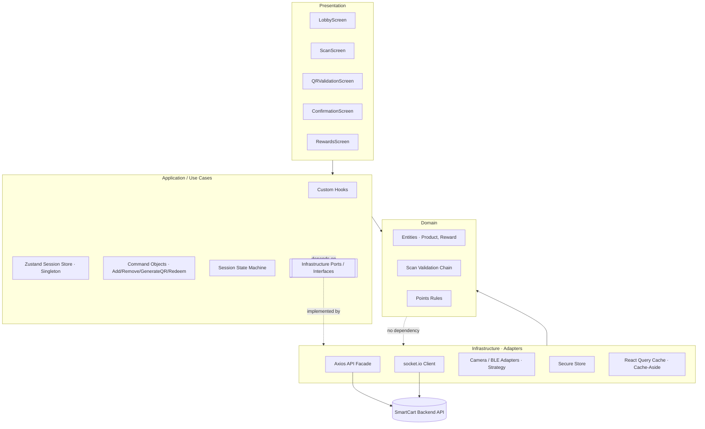

# SmartCart — Frontend Design

**Authors:** SmartCart Team
**Version:** 1.1.0
**Date:** 03/06/2026
**Repository:** https://github.com/davlm05/IICaso_DiseSoftware

> This document fills **Section 1 (Frontend Design)** of `DesignTemplate.md` for the SmartCart application.
> All choices are derived from [`appContext.md`](../DesignContext/context/appContext.md) (screens & flows) and [`designPatterns.md`](../DesignContext/context/designPatterns.md) (GoF pattern applications).
> UX testing evidence and applied corrections live in the repository [`README.md`](../README.md) (UX Analysis).
> Every technology lists a recent stable version, and version compatibility is stated explicitly.

---

## 1.1. Technology Stack

SmartCart is a **consumer-facing mobile app** whose core features — barcode scanning via the device camera, in-store presence detection (GPS/BLE beacons), QR generation at checkout, and push notifications on point credit — all require **native device APIs**. A native cross-platform stack is therefore the correct application type.

| Concern | Choice | Version | Justification |
|---------|--------|---------|---------------|
| **Application Type** | Native Mobile App (managed via Expo) | — | The Discover → Scan → Validate → Accumulate → Redeem loop depends on camera, BLE/GPS, QR rendering, and push — all native capabilities. A native app delivers the in-store performance and hardware access a PWA cannot reliably provide. |
| **Framework** | React Native (Expo SDK 52) | RN **0.76.6** / Expo SDK **52** | A single codebase targets both iOS and Android, halving cost for a consumer app aimed at supermarket shoppers. Expo SDK 52 bundles native modules (camera, secure storage, notifications) with guaranteed inter-compatibility and provides EAS Build/OTA updates. New Architecture (Fabric/TurboModules) is enabled by default for smooth camera/scan UI. |
| **UI Runtime** | React | **18.3.1** | The exact React version shipped and validated by Expo SDK 52 / RN 0.76.6. |
| **Language** | TypeScript | **5.3.3** | Static typing makes the session state machine, command objects, and DTOs (`ProductDTO`) safe to refactor. Version 5.3.3 is the version pinned by `jest-expo` 52 and RN 0.76.6 templates. |
| **State Management** | Zustand | **4.5.5** | Lightweight global store with no boilerplate — ideal for the single active shopping session (points total, pending items, session status). Its subscription model is the natural substrate for the **Observer** and **Singleton** patterns. Compatible with React 18.3.1. |
| **Server State / Data Fetching** | TanStack Query (React Query) | **5.59.16** | Implements the client side of the **Cache-Aside** product lookup (cached barcode → product), automatic retries, and request de-duplication. Decouples server cache from UI state. Works with React 18.3.1 and Axios. |
| **HTTP Client** | Axios | **1.7.7** | Request/response interceptors automate JWT attachment and silent token refresh, and centralize error mapping (the **Facade** over the backend API). |
| **Navigation** | Expo Router (on React Navigation 7) | **4.0.x** | File-based routing over RN screens (Lobby, Scan, QR, Confirmation, Rewards). Bundled with and compatible with Expo SDK 52. |
| **Barcode / Camera Scanning** | expo-camera | **16.0.x** | Provides the live camera feed and barcode recognition for `CameraStrategy`. Shipped with Expo SDK 52, so native compatibility is guaranteed. |
| **In-Store Presence** | expo-location + react-native-ble-plx | location **18.0.x** / ble-plx **3.2.1** | GPS + BLE beacon detection gates point accrual to "user inside affiliated store" (required by the location pill on Screens 1 & 2). ble-plx 3.2.1 supports RN 0.76 New Architecture. |
| **QR Rendering** | react-native-qrcode-svg + react-native-svg | qrcode-svg **6.3.2** / svg **15.8.0** | Renders the large checkout QR on Screen 5. `react-native-svg` 15.8.0 is the version vendored by Expo SDK 52. |
| **Real-time Validation Status** | socket.io-client | **4.8.0** | Pushes POS validation status to the `ValidatingState` screen so "Esperando validación…" flips to the Confirmation screen without manual polling. Falls back to interval polling. |
| **Push Notifications** | expo-notifications (FCM/APNs) | **0.29.x** | Fires the "Puntos acreditados" notification when the backend credits points. Shipped with Expo SDK 52. |
| **Forms & Validation** | React Hook Form + Zod | RHF **7.53.0** / Zod **3.23.8** | Validates the manual-barcode-entry fallback and auth forms. Zod schemas double as the runtime guard for API DTOs. Both compatible with React 18.3.1 / TS 5.3.3. |
| **Styling / Design Tokens** | NativeWind (Tailwind CSS) | NativeWind **4.1.x** / Tailwind **3.4.x** | Utility-first styling enforces the design tokens (color/spacing/typography) consistently across all 7 screens. NativeWind 4 requires RN ≥ 0.76 — aligned with our framework. |
| **Secure Storage** | expo-secure-store | **14.0.x** | Stores JWT access/refresh tokens in the iOS Keychain / Android Keystore (never `AsyncStorage`). Shipped with Expo SDK 52. |
| **Internationalization** | i18next + react-i18next + expo-localization | i18next **23.x** / react-i18next **15.x** | String catalogs per locale (`es-CR` default, `en` fallback) with device-locale detection. Compatible with React 18.3.1. |
| **List Virtualization** | @shopify/flash-list | **1.7.x** | High-performance virtualized lists for the pending-items list and rewards catalog. Supports RN 0.76 New Architecture. |
| **Linting** | ESLint | **9.12.0** | Enforces code quality via flat config with the Expo/React Native preset. |
| **Formatting** | Prettier | **3.3.3** | Deterministic formatting; integrated with ESLint to avoid rule conflicts. |
| **Unit Testing** | Jest (jest-expo) | Jest **29.7.0** / jest-expo **52.0.x** | jest-expo 52 is the preset matched to Expo SDK 52 / RN 0.76.6. Covers utils, stores, commands, and validation handlers. |
| **Integration / UI Testing** | React Native Testing Library | **12.8.0** | Tests component interactions (scan confirmation modal, delete-with-undo, QR generation) on RN 0.76.6. |
| **E2E Testing** | Maestro | **1.39.x** | Flow-based E2E across real devices/simulators for the critical scan → checkout → redeem journey. Simpler than Detox for Expo-managed apps. |
| **Monitoring** | Sentry (sentry-expo) | **9.x** | Captures uncaught exceptions, performance traces, and crash reports in production. |
| **CI/CD** | GitHub Actions + EAS Build | — | GitHub Actions runs lint/test/build; EAS Build produces signed iOS/Android binaries and EAS Submit ships to the stores. |
| **Distribution / Hosting** | Expo EAS → Apple App Store + Google Play | — | Native app distribution channel; EAS Update delivers OTA JS patches between store releases. |

> **Compatibility statement:** The entire stack is anchored on **Expo SDK 52**, which pins React 18.3.1, React Native 0.76.6, react-native-svg 15.8.0, expo-camera 16, expo-notifications 0.29, and TypeScript 5.3.3 as a validated, mutually compatible set. Third-party libraries (Zustand 4.5.5, TanStack Query 5.59, Axios 1.7.7, NativeWind 4.1, RHF 7.53, Zod 3.23.8, ble-plx 3.2.1, socket.io-client 4.8, FlashList 1.7, i18next 23) all declare support for React 18.3.1 and RN 0.76 New Architecture.

### Environments

| Environment | URL / Endpoint | Purpose |
|-------------|----------------|---------|
| Development | `http://localhost:8081` (Metro) → API `http://localhost:3000/api/v1` | Local development on simulator/Expo Go (dev client) |
| Staging | `https://api-staging.smartcart.app/api/v1` | QA and pre-release validation; internal EAS distribution build |
| Production | `https://api.smartcart.app/api/v1` | Live users; App Store / Play Store release |

---

## 1.2. UX / UI Analysis

### Usability Attributes

| Attribute | Target |
|-----------|--------|
| **Learnability** | A first-time shopper completes the scan → validate → redeem loop with no instructions, guided by one primary CTA per screen ("Escanear producto" → "Generar QR de salida" → "Ver mis recompensas"). |
| **Efficiency** | Scanning a product and adding it to the pending list takes ≤ 3 interactions: tap CTA → align barcode → confirm. |
| **Error Prevention** | After a scan, the app requires explicit confirmation of the detected product before adding it (prevents wrong-product accrual). Point accrual is blocked unless the location pill confirms the user is inside an affiliated store. |
| **Visibility of Status** | Current points, pending points (yellow tags), and the live QR validation state ("Esperando validación…") are always visible. The points card progress bar shows the deficit to the next reward. |
| **Confidence Feedback** | Green success toast on each scan ("+15 pts pendientes"), full-green confirmation hero with checkmark, and explicit warning/error messages for failed scans or expired QR. |
| **Consistency** | Uniform design tokens (color, spacing, typography) applied via NativeWind across all 7 screens; the green brand color signals "valid / earn points" everywhere. |
| **Error Recovery** | A failed camera scan offers retry or manual barcode entry without leaving the flow (**Strategy** pattern). A wrongly scanned item can be deleted before validation via the red X (**Command** pattern with undo). |
| **Accessibility** | WCAG 2.1 AA: contrast ≥ 4.5:1 (verified against the green palette), screen-reader labels on camera/QR/CTAs, scalable text, and non-color-only status cues (icons + text alongside green/yellow/red). |

### Branding & Style Guidelines

SmartCart's visual identity is **green-forward** — green communicates "valid scan / points earned" and dominates the checkout and confirmation screens for cashier visibility.

#### Color Palette

| Token | Hex | Usage |
|-------|-----|-------|
| `--color-primary` | `#16A34A` | Primary actions, CTAs ("Escanear", "Generar QR"), confirmation hero |
| `--color-secondary` | `#15803D` | Secondary green elements, pressed states, gradient base for featured reward |
| `--color-accent` | `#FACC15` | Pending-points tags, "Nuevo" highlights, badges |
| `--color-background` | `#F9FAFB` | App background |
| `--color-surface` | `#FFFFFF` | Cards, modals, product list rows |
| `--color-error` | `#DC2626` | Error states, delete (red X), expired QR |
| `--color-success` | `#22C55E` | Success toast, validated-product checkmarks |
| `--color-text-primary` | `#111827` | Main text |
| `--color-text-secondary` | `#6B7280` | Subtitles, captions, motivational subtitle |

#### Typography

| Role | Font Family | Weight | Size | Usage |
|------|-------------|--------|------|-------|
| Display / Heading | Poppins | 700 | 24px | Screen titles, points total |
| Subheading | Poppins | 600 | 18px | Section headers ("Productos con puntos hoy") |
| Body | Inter | 400 | 16px | General text, product names |
| Caption | Inter | 400 | 12px | Labels, hints, expiry dates, alphanumeric QR fallback |
| Button | Poppins | 600 | 14px | CTA text |

#### Spacing & Layout

| Token | Value | Usage |
|-------|-------|-------|
| `--spacing-xs` | 4px | Tight spacing (tag padding) |
| `--spacing-sm` | 8px | Internal component padding |
| `--spacing-md` | 16px | Default padding, card gaps |
| `--spacing-lg` | 24px | Section spacing |
| `--spacing-xl` | 32px | Screen-level padding |

- **Grid System:** Single-column, mobile-first stacked layout (one primary action per screen); 4pt spacing scale.
- **Breakpoints:** `sm: 375px` (baseline phone), `md: 768px` (large phones/tablet), `lg: 1024px` (tablet landscape).
- **Iconography:** Lucide React Native (`lucide-react-native` 0.4xx) — consistent outline set for nav, scan, flash, delete, rewards.
- **Logo Usage Rules:** Minimum 24px height; maintain clear space equal to the cart glyph height; never recolor outside the primary/secondary green or white-on-green.

### Core Business Process

Described as user **actions** and their results (no visual components), per the four core flows of `appContext.md`.

#### Onboarding & Home (Lobby)
1. The user opens the app upon arriving at a store.
2. The system detects the user's presence in an affiliated store and enables point accumulation for the session.
3. The user reviews their current point balance, progress toward the next reward, and the day's sponsored products.
4. The user chooses to begin scanning or to review pending items from a prior moment in the session.

#### Product Scanning & Pending List
1. The user initiates scanning.
2. The system activates barcode capture (camera by default).
3. Alternatively, the user provides the barcode manually when the printed code is damaged.
4. Once a code is captured, the system retrieves the product details and asks the user to confirm the detected product.
5. Upon confirmation, the system validates that the user is in-store, the format is valid, the product is sponsored, and it is not already in the session, then adds it with its pending points.
6. The user may continue scanning or move toward checkout.

#### Checkout & Points Validation
1. With shopping complete, the user requests a checkout validation code.
2. The system issues a unique, time-limited (10-minute) code representing the pending items.
3. The user presents the code to the cashier.
4. The system waits for the store's confirmation of the purchase.
5. Upon confirmation, the system credits the corresponding points and informs the user that the purchase was verified.

#### Rewards Redemption
1. The user opens the rewards section.
2. The system shows the available point balance and the redeemable rewards, marking those still out of reach with the missing amount.
3. The user selects a reward and confirms spending the points.
4. The system deducts the points and issues a coupon ready to use.

### Wireframes

The interactive HTML prototypes (final versions, post-UX-test corrections) are in [`DesignContext/figmaScreens/`](../DesignContext/figmaScreens/):

| Screen | Prototype file | Purpose |
|--------|----------------|---------|
| 1 — Lobby (empty) | [`pantalla-1-main-vacio.html`](../DesignContext/figmaScreens/pantalla-1-main-vacio.html) | Overview of points, sponsored products, primary scan CTA, location pill. |
| 2 — Camera Scanning | [`pantalla-2-escanear.html`](../DesignContext/figmaScreens/pantalla-2-escanear.html) | Capture barcode via camera with manual-entry fallback and in-store confirmation. |
| 2B — Manual Entry | [`pantalla-2B-ingreso-manual.html`](../DesignContext/figmaScreens/pantalla-2B-ingreso-manual.html) | Fallback barcode entry when the printed code is damaged (**ManualEntryStrategy**). |
| 3 — Lobby (1 product) | [`pantalla-3-main-1producto.html`](../DesignContext/figmaScreens/pantalla-3-main-1producto.html) | First scanned product with toast, pending-points subsection, delete option. |
| 4 — Lobby (multiple) | [`pantalla-4-main-3productos.html`](../DesignContext/figmaScreens/pantalla-4-main-3productos.html) | Full pending list with dual CTAs (scan more / generate QR). |
| 5 — QR Validation | [`pantalla-5-qr-validacion.html`](../DesignContext/figmaScreens/pantalla-5-qr-validacion.html) | Full-green QR + alphanumeric fallback, 10-min validity, polling status. |
| 6 — Confirmation | [`pantalla-6-confirmacion.html`](../DesignContext/figmaScreens/pantalla-6-confirmacion.html) | Points-credited hero, validated products, new total, paths to home or rewards. |
| 7 — My Rewards | [`pantalla-7-recompensas.html`](../DesignContext/figmaScreens/pantalla-7-recompensas.html) | Available rewards + redeemed coupons tabs; locked rewards show point deficit. |

**Corrections reflected in the final wireframes** (traced from the UX test below):

| UX Finding | Wireframe change | Screens affected |
|------------|------------------|------------------|
| Secondary actions competed with the primary CTA (F1) | Primary CTA given dominant size/contrast; secondary controls demoted to outline style | 3, 4 (dual-CTA lobby) |
| Users lacked sense of progress (F2) | Lightweight step/context micro-copy added on the main flow | 2, 4, 5 |
| Visual overwhelm / density (F3) | Progressive disclosure: non-essential elements hidden by default on dense screens | 1, 4 |
| Typography rated clear (F4 — positive) | Typographic system retained unchanged | all |

### UX Test Results

Full evidence (test setup, heatmaps, raw outcomes, and the findings/corrections matrix) is documented in the repository [`README.md`](../README.md). Summary:

- **Platform:** Maze (unmoderated remote) — prototype: `https://t.maze.co/542525865`.
- **Participants:** 5 external design students (≥ 4 required by `Caso #2.md`).
- **Task & success criteria:** *Follow the normal flow of the application* → scan and complete the pending list and reach the rewards screen.

**Recorded outcomes (time-on-task & success rate):**

| Participant | Outcome | Duration |
|-------------|---------|----------|
| 542985010 | Success | 00:02:13 |
| 542830539 | Success | 00:05:20 |
| 542990056 | Success | 00:02:57 |
| 542985511 | Fail | 00:01:52 |

**Heatmaps:** [Lobby](../media/mazeLobby.jpg) · [Scanning](../media/mazeScanning.jpg) · [Pending Items / QR](../media/mazePendingItems.jpg) · [QR Validation](../media/mazeQRValidation.jpg) · [Rewards](../media/mazeRewards.jpg).

**Key Findings & Applied Corrections** (justified):

| # | Finding | Dimension | Correction Applied | Justification |
|---|---------|-----------|--------------------|---------------|
| 1 | Some screens give greater visual prominence to secondary actions than to the intended primary action; correlates with the fastest-but-failed participant (flow confusion, not readability). | Learnability / Visual Hierarchy | Increase size and color contrast of the primary CTA per screen; reduce secondary-control prominence. | A clearly differentiated primary CTA removes action ambiguity and guides the user through the loop without exploration. |
| 2 | Users lack context about which step they are on and what is expected next. | Learnability / Feedback | Add a lightweight progress indicator and contextual micro-copy on key main-flow screens. | Progress feedback aligns expectations, reduces navigation anxiety, and lowers intermediate drop-off. |
| 3 | Too many elements visible at once → sense of overwhelm (highest completion time confirms efficiency impact). | Efficiency / Cognitive Load | Apply progressive disclosure; reduce default-visible elements on dense screens (lobby, product list). | Lower information density reduces cognitive load and speeds decision-making. |
| 4 | Text legibility rated clear (positive validation). | N/A (positive) | No change — retain the current typographic system. | Confirms font/size/contrast decisions are appropriate; the one failure traces to hierarchy (F1), not typography. |

---

## 1.3. Component Design Strategy

- **Strategy Name:** **Atomic Design** layered on top of a **Feature-Sliced** folder structure (atoms/molecules/organisms for shared UI; feature folders for screen logic).
- **Component Hierarchy** (each component links to its location in the [scaffold](#110-project-scaffold)):

  - **Atoms** (`/src/components/atoms/`): `Button.tsx`, `Input.tsx`, `Icon.tsx`, `Badge.tsx`, `PointsTag.tsx`, `LocationPill.tsx`, `Toast.tsx`.
  - **Molecules** (`/src/components/molecules/`): `ProductCard.tsx`, `PointsCard.tsx`, `ScanConfirmationModal.tsx`, `RewardCard.tsx`, `QRCodeView.tsx`.
  - **Organisms** (`/src/components/organisms/`): `BottomNav.tsx`, `PendingItemsList.tsx`, `SponsoredCarousel.tsx`, `RewardsCatalog.tsx`, `CouponsList.tsx`.
  - **Templates / Screens** (`/app/`): `index.tsx` (Lobby), `scan.tsx`, `checkout.tsx`, `confirmation.tsx`, `rewards.tsx`.

#### How to build a component (developer recipe)

Every shared UI component follows the same structure so the team builds them uniformly:

1. **One component per file**, `PascalCase` name matching the filename. Co-locate its test as `Component.test.tsx`.
2. **Typed props contract first.** Declare a `Props` interface; no `any`. Presentational components receive data only via props — no store/network access.
3. **Container / Presentational split.** Stateless UI lives in `/src/components/**`; the logic+state wrapper lives in `/src/features/<feature>/` and passes plain props down.
4. **Styling via NativeWind tokens only** — use `className` with the design tokens from `/src/styles`; never hard-code hex values.
5. **Accessibility is mandatory** — set `accessibilityRole` and `accessibilityLabel`; convey status with icon + text, never color alone.
6. **i18n for all copy** — wrap user-visible strings in `t('...')`; no literal Spanish in JSX.

```tsx
// /src/components/molecules/ProductCard.tsx
import { View, Text, Pressable } from 'react-native';
import { useTranslation } from 'react-i18next';
import { PointsTag } from '../atoms/PointsTag';
import type { ProductDTO } from '@/types/ProductDTO';

interface ProductCardProps {
  product: ProductDTO;
  isNew?: boolean;
  onDelete?: (barcode: string) => void; // undo-capable RemoveProductCommand
}

export function ProductCard({ product, isNew = false, onDelete }: ProductCardProps) {
  const { t } = useTranslation();
  return (
    <View
      className={`flex-row items-center rounded-xl bg-surface p-md ${isNew ? 'border border-primary' : ''}`}
      accessibilityRole="summary"
      accessibilityLabel={t('product.card.label', { name: product.name, points: product.points })}
    >
      <Text className="font-body text-text-primary flex-1">{product.name}</Text>
      <PointsTag points={product.points} pending />
      {onDelete && (
        <Pressable
          accessibilityRole="button"
          accessibilityLabel={t('product.card.delete', { name: product.name })}
          onPress={() => onDelete(product.barcode)}
        />
      )}
    </View>
  );
}
```

- **Reusability:** Shared, stateless UI lives in `/src/components` and receives data via props (Container/Presentational split). Feature-specific logic and state live in `/src/features/<feature>`. Naming: `PascalCase` components, `camelCase` hooks prefixed `use`, one component per file.
- **Internationalization (i18n):** `i18next` 23.x + `react-i18next` 15.x with `expo-localization` for locale detection. Strings live in `/src/lib/i18n/<locale>.json`; default `es-CR` (primary market is Costa Rican supermarkets), with `en` fallback.
- **Responsiveness:** Mobile-first single-column layouts; NativeWind responsive prefixes adapt spacing at the `md`/`lg` breakpoints for large phones and tablets. Safe-area insets handled via `react-native-safe-area-context`.
- **Accessibility:** Every interactive element sets `accessibilityRole` and `accessibilityLabel`; status is conveyed by icon + text (not color alone); focus order follows visual order; dynamic type respected.

---

## 1.4. Security

### Authentication

- **Provider / Method:** JWT (access + refresh) issued by the SmartCart backend.
- **Implementing classes / files:**
  - `/src/api/client.ts` — Axios instance; **request interceptor** attaches `Authorization: Bearer <access>`, **response interceptor** handles the `401` silent-refresh.
  - `/src/api/endpoints/auth.ts` — `login()`, `refresh()`, `logout()` endpoint functions.
  - `/src/hooks/useAuth.ts` — exposes `login`/`logout`/`session` to screens.
  - `/src/store/sessionStore.ts` — Zustand **Singleton** holding auth/session state.
  - `/src/lib/secureStore.ts` — `expo-secure-store` wrapper for token persistence in Keychain/Keystore.
- **Flow:**
  1. User submits email + password (validated client-side with Zod in the auth form).
  2. Backend validates credentials and returns an access token (short-lived) and a refresh token.
  3. `useAuth` stores both tokens in **expo-secure-store** (Keychain/Keystore) — never in `AsyncStorage`.
  4. The Axios request interceptor (`client.ts`) attaches `Authorization: Bearer <access>` to every protected request.
  5. On a `401`, the response interceptor uses the refresh token to obtain a new access token once, then retries the original request; concurrent requests queue behind a single in-flight refresh.

### Authorization (RBAC)

SmartCart spans **two surfaces**: the consumer mobile app (this document) and a separate **back-office tool** for the fraud-review Human-in-the-Loop flow (`designPatterns.md`). The back office is **not admin-only** — it has its own role hierarchy.

| Role | Surface | Description | Permissions |
|------|---------|-------------|-------------|
| `user` | Mobile app | Registered shopper | Scan products, manage pending session, generate checkout QR, browse/redeem rewards, view own points history |
| `admin` | Mobile app / web | Store administrator | All `user` permissions + manage product catalog & sponsored list, manage rewards, view store analytics |
| `BACKOFFICE_OPERATOR` | Back office | Fraud-review operator | View the human-review queue, approve/reject flagged QR-validation sessions (`ReviewController`); **cannot approve a session they originated** |
| `BACKOFFICE_SUPERVISOR` *(assumption)* | Back office | Operator's superior | All `BACKOFFICE_OPERATOR` permissions + reassign/escalate items, view audit logs, adjust per-environment risk thresholds |
| `SECURITY_ADMIN` *(assumption)* | Back office | Fraud/security team | Manage backoffice roles, immutable audit-log access, override timeouts |

> **Assumptions explicitly stated:** `designPatterns.md` defines `BACKOFFICE_OPERATOR` and requires "operator **or superior**" on the `ReviewController`, which implies the supervisor/security tiers above. These are documented so the backend RBAC middleware and the backoffice tool are designed for more than a single admin role. The consumer app ships only `user`/`admin` permission checks; the `BACKOFFICE_*` roles are enforced server-side and never surface in the mobile bundle.

**Enforcement:** Role checks live server-side per token (the client never trusts IDs alone). The mobile app gates `admin`-only UI behind the role claim in the JWT; the backoffice `ReviewController` requires `BACKOFFICE_OPERATOR` or higher via auth middleware, and logs every decision with `reviewerId`, `sessionId`, `timestamp`, and `signals` (append-only).

### Session Management

- **Token Expiry:** Access token 15 min / Refresh token 7 days.
- **Refresh Strategy (specific):** Silent refresh implemented in the Axios response interceptor at `/src/api/client.ts`. A module-level `isRefreshing` flag plus a `pendingQueue` ensures a **single in-flight refresh**; concurrent `401`s subscribe to the queue and replay once the new access token arrives.
- **Session State Machine:** The shopping session's lifecycle (`Empty → Scanning → WithProducts → Validating → Confirmed`) lives in `/src/features/session/states/` (**State** pattern) and is backed by the Singleton `/src/store/sessionStore.ts`.
- **Storage Decision:** `expo-secure-store` (hardware-backed Keychain/Keystore) instead of `AsyncStorage`/`localStorage`, because tokens are sensitive and `AsyncStorage` is unencrypted on device.
- **Logout Behavior:** `useAuth.logout()` clears tokens from secure store, calls `auth.logout()` to revoke the refresh token server-side, resets the Zustand session store, and clears the React Query cache.

### Secure Configuration

- **Environment Variables:** Managed per environment via `app.config.ts` `extra` + EAS environment variables; only non-secret, public config (API base URL) is bundled. No secrets committed to VCS.
- **Secret Management Platform:** EAS Secrets for build-time values; the mobile client holds **no** server secrets (POS/B2B API keys live exclusively in the backend).

### OWASP Mobile — What the team will implement

Mapped to the **OWASP Mobile Top 10 (2024) / MASVS**, each row states the concrete action, the library/config used, and where it is enforced:

| OWASP / MASVS item | What the team will do | Library / Config | Where enforced |
|--------------------|-----------------------|------------------|----------------|
| M9 Insecure Data Storage | Persist tokens only in hardware-backed storage; keep no PII in plain storage | `expo-secure-store` | `/src/lib/secureStore.ts`, used by `useAuth` |
| M5 Insecure Communication | Force HTTPS/TLS 1.2+; enable certificate pinning for the API host in production | Axios `baseURL` (https only) + `react-native-ssl-pinning` config | `/src/api/client.ts`, `app.config.ts` |
| M4 Insufficient Input Validation / Injection | Validate & sanitize all manual-barcode and auth input before any request | Zod schemas | `/src/lib/validation/*.ts`, RHF resolvers |
| M3 Insecure Authentication/Authorization (IDOR) | Never trust client-side IDs; all resource access authorized server-side per token | JWT claims + backend RBAC | server-side; client sends Bearer token only |
| M8 Security Misconfiguration / secrets | No secrets in the bundle; public config only via EAS env | EAS Secrets, `app.config.ts extra` | build pipeline |
| M7 Insufficient Binary Protection (reverse engineering/tampering) | Strip `console.*` in production, ship Hermes bytecode, monitor anomalies | `babel-plugin-transform-remove-console`, Hermes, Sentry | `babel.config.js`, EAS production profile |
| Observability for abuse detection | Tag crashes/traces with screen + session state for incident response | Sentry (`sentry-expo`) | `/app/_layout.tsx` init |

---

## 1.5. Layered Architecture

- **Architectural Pattern:** **Layered (Ports & Adapters) with a Feature-Sliced layout.** Dependencies point **inward**: Presentation depends on Application, Application depends on the Domain and on **Infrastructure abstractions (interfaces/ports)** that it declares; concrete Infrastructure implementations (adapters) are **injected at the composition root** (`/app/_layout.tsx` providers). This dependency inversion is what keeps the Domain pure and the data/device layer swappable.

- **Layer Responsibilities:**

| Layer | Responsibility | Examples |
|-------|---------------|----------|
| Presentation | Render UI, handle gestures/events; no business logic | Screens (`/app`), atoms/molecules/organisms |
| Application / Use Cases | Orchestrate business logic; define ports for infrastructure | Custom hooks, Zustand stores, **Command** objects, session **State** machine |
| Domain | Core business rules & entities; framework-free | `Product`/`ProductDTO`, session states, scan-validation handlers, points rules |
| Infrastructure | Implement ports — external communication & device APIs | Axios client (**Facade**), socket.io client, secure-store, camera/BLE adapters, React Query cache |

- **Layer Access Rules (consistent with the diagram):**
  - Presentation may call **only** the Application layer (hooks/stores).
  - Application may use the Domain directly, and may use Infrastructure **only through the interfaces it declares** — concrete adapters are injected, not imported.
  - **Domain must not import Infrastructure or React** — it stays pure and unit-testable.
  - Infrastructure depends inward on Domain types (DTOs); the Domain never depends on Infrastructure.

- **Diagram** (solid arrow = depends on; the Application→Infrastructure dependency is on an interface, realized by an injected adapter):



---

## 1.6. Design Patterns

Each pattern below is implemented from its detailed **ficha** (functionality, actors, class diagram, `/src` location, developer restrictions, and exception handling) in [`designPatterns.md`](../DesignContext/context/designPatterns.md). The table maps each pattern to its frontend location; follow the linked ficha for the class-level design.

| Pattern | Application in SmartCart | Frontend location | Ficha |
|---------|--------------------------|-------------------|-------|
| **Singleton** | Exactly one active `ShoppingSession` per authenticated user — backed by a single Zustand store, the single source of truth. | `/src/store/sessionStore.ts` | [Singleton](../DesignContext/context/designPatterns.md) |
| **Observer** | A successful scan notifies the points card, product list, toast, and session state independently via store subscriptions. | `/src/store/sessionStore.ts`, `/src/features/scan/scannerService.ts` | [Observer](../DesignContext/context/designPatterns.md) |
| **State** | The session moves through `Empty → Scanning → WithProducts → Validating → Confirmed`; each state defines valid actions/UI. | `/src/features/session/states/` | [State](../DesignContext/context/designPatterns.md) |
| **Command** | `AddProductCommand`, `RemoveProductCommand` (with **undo**), `GenerateQRCommand`, `RedeemCouponCommand`. | `/src/features/session/commands/` | [Command](../DesignContext/context/designPatterns.md) |
| **Strategy** | Barcode capture: `CameraStrategy` (expo-camera) and `ManualEntryStrategy`, same result shape. | `/src/features/scan/strategies/` | [Strategy](../DesignContext/context/designPatterns.md) |
| **Chain of Responsibility** | Client-side pre-validation: `LocationHandler → BarcodeFormatHandler → SponsoredProductHandler → DuplicateScanHandler → SessionAddHandler`. | `/src/features/scan/validation/` | [CoR](../DesignContext/context/designPatterns.md) |
| **Decorator** | Composable product states: `SponsoredProductDecorator`, `NewlyScannedDecorator`, `ValidatedProductDecorator`, `LockedRewardDecorator`. | `/src/components/product/decorators/` | [Decorator](../DesignContext/context/designPatterns.md) |
| **Factory Method** | `RewardFactory` creates `DiscountCoupon`, `TwoForOneCoupon`, `CategoryCoupon`. | `/src/features/rewards/factories/` | [Factory Method](../DesignContext/context/designPatterns.md) |
| **Facade** | A single API module hides all HTTP details (base URL, interceptors, error mapping) from components. | `/src/api/client.ts`, `/src/api/endpoints/` | — |
| **Cache-Aside** | Barcode → product lookups check the React Query cache first; on a miss, fetch and cache — mirrors the backend `ProductCacheService` contract. | `/src/api/endpoints/products.ts` | [Cache-Aside](../DesignContext/context/designPatterns.md) |
| **Container / Presentational** | Feature containers own logic/state and pass plain props to stateless UI. | `/src/features/` vs `/src/components/` | — |

> **Backend-side patterns referenced by the app:** the **Adapter** (multi-chain POS), **Proxy** (secure QR validation), and the **Human-in-the-Loop** fraud-review classes are designed in `designPatterns.md` and run server-side. The frontend only consumes their results (QR validation status via socket/polling, and the "Verificando…" state during human review) — see Asynchronous Operations below.

### Asynchronous Operations

The app has **several distinct** async operations, each with its own mechanism, loading state, retry policy, and failure behavior:

| Async operation | Mechanism | Loading state | Retry / idempotency | Failure behavior |
|-----------------|-----------|---------------|---------------------|------------------|
| **Barcode → product lookup** | TanStack Query + Axios (**Cache-Aside**) | Scan-line animation while resolving | Auto-retry on network/5xx, exp. backoff, max 3 (idempotent read) | Toast "Producto no disponible"; offer manual retry |
| **Sponsored carousel / rewards catalog fetch** | TanStack Query | Skeleton placeholders | Auto-retry (idempotent read) | Cached data shown if available; error banner otherwise |
| **QR generation** | Axios POST (`GenerateQRCommand`) | Button spinner | **No** auto-retry (non-idempotent) | Surface error; user re-taps explicitly |
| **POS validation status** | socket.io room `session:{id}`, **fallback** polling `GET /sessions/:id` every 3 s | "Esperando validación…" on `ValidatingState` | Socket reconnect; polling until 10-min QR expiry | On expiry → "El código expiró, genéralo de nuevo" |
| **Reward redemption** | Axios POST (`RedeemCouponCommand`) | Button spinner | **No** auto-retry (non-idempotent) | Error toast; points untouched until server confirms |
| **Long-running fraud review (HITL)** | Server-side; app shows status pushed via socket/push | "Verificando…" status, never blocks indefinitely | n/a (resolves on push/socket or expiry/timeout, ≤ 2 min) | Resolves to confirm/reject or timeout message |
| **Push notification ("Puntos acreditados")** | expo-notifications (FCM/APNs) | n/a (background) | Delivered by OS service | Silent if undelivered; in-app confirmation still shown |

### Error Handling & Observability (implementation design)

- **Global error handler:** The Axios response interceptor in `/src/api/client.ts` catches every API error, maps the HTTP status to friendly Spanish copy, and dispatches it to a global notification slice in `/src/store/notificationStore.ts`:

```ts
// /src/store/notificationStore.ts
interface Notification { id: string; type: 'error' | 'warning' | 'success'; message: string }
interface NotificationState {
  queue: Notification[];
  push: (n: Omit<Notification, 'id'>) => void;
  dismiss: (id: string) => void;
}
```

- **HTTP → user-facing copy map** (extended):

| Condition | Copy (es-CR) |
|-----------|--------------|
| Expired QR (`410`) | "El código expiró, genéralo de nuevo" |
| Out-of-store scan (`403 LOCATION`) | "Acércate a una tienda afiliada para sumar puntos" |
| Product not found (`404`) | "No encontramos ese producto" |
| Network/timeout | "Sin conexión. Revisa tu internet e intenta de nuevo" |
| Server error (`5xx`) | "Servicio temporalmente no disponible" |

- **Error Boundaries:** One React `ErrorBoundary` per feature (`scan`, `checkout`, `rewards`), defined in `/src/components/ErrorBoundary.tsx` and mounted in `/app/_layout.tsx`, so a single feature failure cannot crash the app; it renders a retry fallback and reports to Sentry.
- **Retry logic:** Centralized TanStack Query defaults — retry idempotent reads up to 3× with exponential backoff; **non-idempotent** actions (QR generation, redemption) are configured with `retry: false`.
- **Monitoring:** Sentry captures uncaught exceptions and performance traces, tagged with screen and session state.
- **Logging:** `console.*` stripped from production via Babel plugin; errors forwarded to Sentry only.

---

## 1.7. Performance

Each strategy states **where** it is applied and **how** (developer instruction):

| Strategy | Where | How |
|----------|-------|-----|
| **Lazy Loading** | `/app/scan.tsx` | Mount the `expo-camera` module only when the Scan route is active; Expo Router lazy-loads route screens by default. |
| **Code Splitting** | Metro config + heavy modules (camera, QR/SVG) | Use Metro inline requires + route-level splitting so camera/QR/SVG load on demand, not at startup. |
| **Bundle Optimization** | EAS production profile (`eas.json`) | Hermes bytecode precompilation, tree-shaking, dead-code elimination in production builds. |
| **Image Optimization** | `SponsoredCarousel.tsx`, `RewardCard.tsx` | Use `expo-image` with disk/memory cache and `contentFit`; serve sponsored images as WebP at device resolution. |
| **Memoization** | `ProductCard.tsx`, `RewardCard.tsx`, `PendingItemsList.tsx` | Wrap cards in `React.memo`; compute pending-points totals with `useMemo`/`useCallback`; subscribe to Zustand with selective selectors to avoid over-render. |
| **Virtualization** | `/src/components/organisms/PendingItemsList.tsx`, `RewardsCatalog.tsx` | Render long lists with `@shopify/flash-list` (1.7.x) instead of `ScrollView`/`FlatList`. |
| **Caching** | `/src/api/endpoints/*` | TanStack Query caches product lookups and rewards (Cache-Aside); EAS Update ships OTA JS without a full store release. |

---

## 1.8. Testing Strategy

- **Where tests live:** Co-located with the unit under test as `*.test.ts(x)` (e.g. `RemoveProductCommand.test.ts` beside `RemoveProductCommand.ts`); E2E flows live in `/e2e/*.yaml` (Maestro). Coverage is enforced in CI.

| Level | Tool | Scope | Example | Min. Coverage |
|-------|------|-------|---------|---------------|
| **Unit** | Jest 29.7.0 (jest-expo 52) | Session store, command objects (incl. undo), scan-validation chain, points rules, utils | `RemoveProductCommand` undo restores the prior pending total | 80% |
| **Integration** | React Native Testing Library 12.8.0 | Scan-confirm modal, delete-with-undo, QR generation, manual-entry fallback, reward redemption | Tapping the red X removes a `ProductCard` and shows an undo toast | 70% |
| **UI / E2E** | Maestro 1.39.x | Critical flow: register → scan → generate QR → confirm → redeem | Full happy-path journey on simulator | Key flows 100% |
| **Accessibility** | `@axe-core/react` + manual VoiceOver/TalkBack passes | WCAG 2.1 AA on all interactive screens | No color-only status cues on the QR screen | 0 critical violations |

---

## 1.9. CI/CD Pipeline (Frontend)

The pipeline is defined in **`.github/workflows/ci.yml`** (GitHub Actions). Each stage is a named job with concrete commands:

| # | Job | Command | Gate |
|---|-----|---------|------|
| 1 | Install & cache deps | `npm ci` (with `actions/cache` on `~/.npm`) | — |
| 2 | Lint | `npx eslint .` | Fail blocks merge |
| 3 | Format check | `npx prettier --check .` | Fail blocks merge |
| 4 | Type check | `npx tsc --noEmit` | Fail blocks merge |
| 5 | Unit & integration tests | `npx jest --coverage` | Fail / below threshold blocks merge |
| 6 | Build | `eas build --platform all --profile preview --non-interactive` | Fail blocks merge |
| 7 | E2E | `maestro test e2e/` | Fail blocks merge |
| 8 | Deploy | `eas update --branch staging` (auto on `main`) → `eas submit` (manual, post-QA) | Manual promotion |

```
[Push to PR / main] → 1 Install → 2 Lint → 3 Format → 4 Type Check
   → 5 Unit+Integration → 6 EAS Build → 7 Maestro E2E → 8 EAS Update(staging)→Submit(prod)
```

- **Tooling:** GitHub Actions for lint/type/test; `expo/expo-github-action` + EAS Build/Submit for binaries and store submission.
- **Branch Strategy:** GitHub Flow — feature branches → PR → `main`.
- **Quality Gates:** A PR cannot merge if lint, format, type check, tests, or build fail; minimum coverage thresholds (§1.8) are enforced in job 5.
- **Deployment Strategy:** Merge to `main` → automatic **EAS Update** to the staging channel; manual promotion (EAS Submit) to production store tracks after QA sign-off.

---

## 1.10. Project Scaffold

- **Root:** `/src` (Expo Router routes in `/app`)

```
/src
├── /api/                  # API Facade + Cache-Aside
│   ├── client.ts          # Axios instance: interceptors, JWT refresh (Singleton)
│   └── /endpoints/        # products.ts, sessions.ts, rewards.ts, auth.ts, validation.ts
├── /assets/               # Images, fonts (Poppins, Inter), icons
├── /components/           # Reusable UI (Atomic Design)
│   ├── /atoms/            # Button, Input, Badge, PointsTag, LocationPill, Toast
│   ├── /molecules/        # ProductCard, PointsCard, ScanConfirmationModal, RewardCard, QRCodeView
│   ├── /organisms/        # BottomNav, PendingItemsList, SponsoredCarousel, RewardsCatalog, CouponsList
│   ├── /product/decorators/  # Sponsored/NewlyScanned/Validated/LockedReward (Decorator)
│   └── ErrorBoundary.tsx  # Per-feature error boundary
├── /features/             # Feature logic & local state
│   ├── /scan/             # scannerService.ts, /strategies/ (Camera, Manual), /validation/ (CoR chain)
│   ├── /session/          # /states/ (State machine), /commands/ (Command + undo)
│   ├── /checkout/         # QR generation + validation status (WebSocket/polling)
│   └── /rewards/          # /factories/ (RewardFactory), redemption hooks
├── /hooks/                # useSession, useScan, useRewards, useAuth
├── /lib/                  # utils, constants, secureStore.ts, /validation/ (Zod), /i18n/ (es-CR, en)
├── /store/                # Zustand stores (sessionStore = Singleton, notificationStore), slices
├── /styles/               # NativeWind theme, design tokens
└── /types/                # Shared TS types & DTOs (ProductDTO, RewardDTO, SessionDTO)

/app                       # Expo Router screens
├── _layout.tsx            # Root nav + providers (Query, SafeArea, ErrorBoundary, Sentry)
├── index.tsx              # Lobby
├── scan.tsx               # Camera scanning
├── checkout.tsx           # QR validation
├── confirmation.tsx       # Points credited
└── rewards.tsx            # Rewards & coupons

/e2e                       # Maestro flow files (*.yaml)
.github/workflows/ci.yml   # CI/CD pipeline
```
