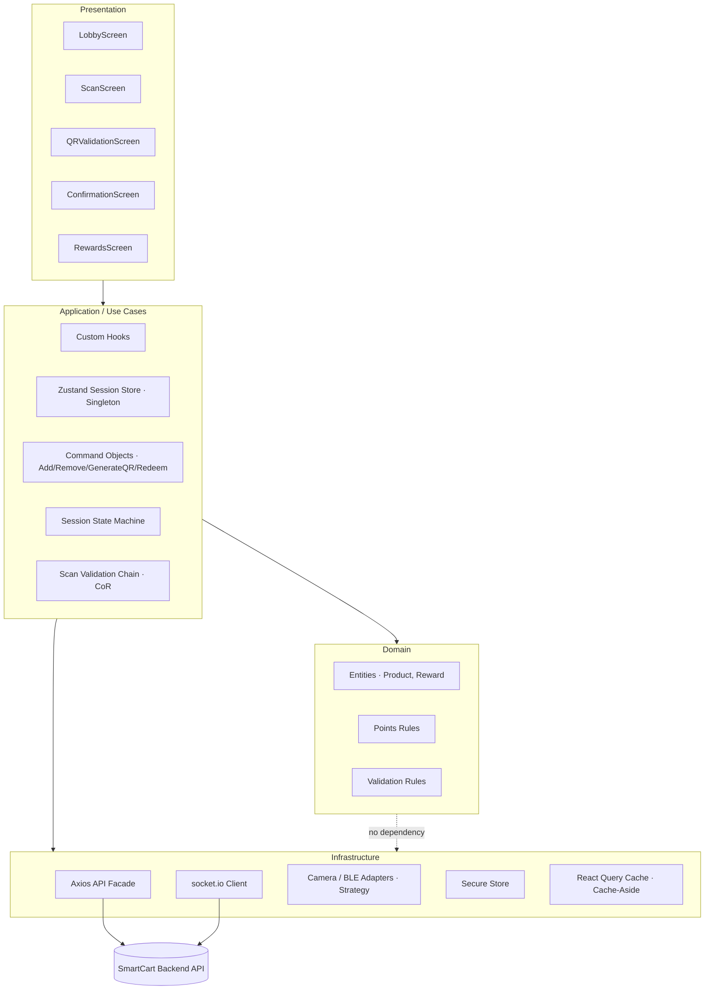
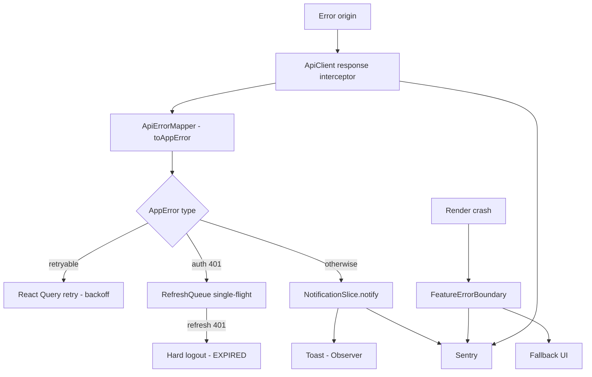

# UX Analysis

## Test Setup

- **Platform Used:** Maze | User Research and Testing Platform
- **Prototype Link:** [https://t.maze.co/542525865]
- **Prototype Scope:** Main onboarding, product scanning, QR checkout, and rewards redemption flow
- **Number of Participants:** 4

### Defined Tasks

| # | Task Description | Success Criteria |
|---|-----------------|-----------------|
| 1 | [Follow the normal flow of the application] | [Scan and complete list and reach the rewards screen] |

---

## Test Results

### Task 1 — [Follow the normal flow of the application]

| Participant | Outcome | Duration |
|-------------|---------|----------|
| [542985010]        | Success | [00:02:13] |
| [542830539]        | Success | [00:05:20] |
| [542990056]        | Success | [00:02:57] |
| [542985511]        | Fail | [00:01:52] |

---

## Heatmaps

| Screen | Heatmap |
|--------|----------------|
|Lobby (empty) |  |
|Camera Scanning |  |
|Pending Items / QR Generation |  |
|QR Validation |  |
| Rewards |  |

---

## Usability Attributes

| Attribute | Target |
|-----------|--------|
| **Learnability** | A first-time shopper completes the scan → validate → redeem loop with no instructions, guided by one primary CTA per screen ("Escanear producto" → "Generar QR de salida" → "Ver mis recompensas"). |
| **Efficiency** | Scanning a product and adding it to the pending list takes ≤ 3 interactions: tap CTA → align barcode → confirm. |
| **Error Prevention** | After a scan, the app requires explicit confirmation of the detected product before adding it (prevents wrong-product accrual). Point accrual is blocked unless the location pill confirms the user is inside an affiliated store. |
| **Visibility of Status** | Current points, pending points (yellow tags), and the live QR validation state ("Esperando validación…") are always visible. The points card progress bar shows the deficit to the next reward. |
| **Confidence Feedback** | Green success toast on each scan ("+15 pts pendientes"), full-green confirmation hero with checkmark, and explicit warning/error messages for failed scans or expired QR. |
| **Consistency** | Uniform design tokens (color, spacing, typography) applied via NativeWind across all 7 screens; the green brand color signals "valid / earn points" everywhere. |
| **Error Recovery** | A failed camera scan offers retry or manual barcode entry without leaving the flow (**Strategy** pattern). A wrongly scanned item can be deleted before validation via the red X (**Command** pattern with undo). |
| **Accessibility** | WCAG 2.1 AA: contrast ≥ 4.5:1 (verified against the green palette), screen-reader labels on camera/QR/CTAs, scalable text, and non-color-only status cues (icons + text alongside green/yellow/red). |

---

## Branding & Style Guidelines

SmartCart's visual identity is **green-forward** — green communicates "valid scan / points earned" and dominates the checkout and confirmation screens for cashier visibility.

#### Color Palette

| Token | Hex | Usage |
|-------|-----|-------|
| `--color-primary` | `#16A34A` | Primary actions, CTAs ("Escanear", "Generar QR"), confirmation hero |
| `--color-secondary` | `#15803D` | Secondary green elements, pressed states, gradient base for featured reward |
| `--color-accent` | `#FACC15` | Pending-points tags, "Nuevo" highlights, badges |
| `--color-background` | `#F9FAFB` | App background |
| `--color-surface` | `#FFFFFF` | Cards, modals, product list rows |
| `--color-error` | `#DC2626` | Error states, delete (red X), expired QR |
| `--color-success` | `#22C55E` | Success toast, validated-product checkmarks |
| `--color-text-primary` | `#111827` | Main text |
| `--color-text-secondary` | `#6B7280` | Subtitles, captions, motivational subtitle |

### Typography

| Role | Font Family | Weight | Size | Usage |
|------|-------------|--------|------|-------|
| Display / Heading | Poppins | 700 | 24px | Screen titles, points total |
| Subheading | Poppins | 600 | 18px | Section headers ("Productos con puntos hoy") |
| Body | Inter | 400 | 16px | General text, product names |
| Caption | Inter | 400 | 12px | Labels, hints, expiry dates, alphanumeric QR fallback |
| Button | Poppins | 600 | 14px | CTA text |

### Spacing & Layout

| Token | Value | Usage |
|-------|-------|-------|
| `--spacing-xs` | 4px | Tight spacing (tag padding) |
| `--spacing-sm` | 8px | Internal component padding |
| `--spacing-md` | 16px | Default padding, card gaps |
| `--spacing-lg` | 24px | Section spacing |
| `--spacing-xl` | 32px | Screen-level padding |

- **Grid System:** Single-column, mobile-first stacked layout (one primary action per screen); 4pt spacing scale.
- **Breakpoints:** `sm: 375px` (baseline phone), `md: 768px` (large phones/tablet), `lg: 1024px` (tablet landscape).
- **Iconography:** Lucide React Native (`lucide-react-native` 0.468.0) — consistent outline set for nav, scan, flash, delete, rewards.
- **Logo Usage Rules:** Minimum 24px height; maintain clear space equal to the cart glyph height; never recolor outside the primary/secondary green or white-on-green.

---

## Core Business Process

### Onboarding & Home (Lobby)
1. The user opens the app upon arriving at a store.
2. The system detects the user's presence in an affiliated store and enables point accumulation for the session.
3. The user reviews their current point balance, progress toward the next reward, and the day's sponsored products.
4. The user chooses to begin scanning or to review pending items from a prior moment in the session.

### Product Scanning & Pending List
1. The user initiates scanning.
2. The system activates barcode capture (camera by default).
3. Alternatively, the user provides the barcode manually when the printed code is damaged.
4. Once a code is captured, the system retrieves the product details and asks the user to confirm the detected product.
5. Upon confirmation, the system validates that the user is in-store, the format is valid, the product is sponsored, and it is not already in the session, then adds it with its pending points.
6. The user may continue scanning or move toward checkout.

### Checkout & Points Validation
1. With shopping complete, the user requests a checkout validation code.
2. The system issues a unique, time-limited (10-minute) code representing the pending items.
3. The user presents the code to the cashier.
4. The system waits for the store's confirmation of the purchase.
5. Upon confirmation, the system credits the corresponding points and informs the user that the purchase was verified.

### Rewards Redemption
1. The user opens the rewards section.
2. The system shows the available point balance and the redeemable rewards, marking those still out of reach with the missing amount.
3. The user selects a reward and confirms spending the points.
4. The system deducts the points and issues a coupon ready to use.

---

## Wireframes

| Screen | Prototype | Purpose |
|--------|----------------|---------|
| 1 — Lobby (empty) |  | Overview of points, sponsored products, primary scan CTA, location pill. |
| 2 — Camera Scanning |  | Capture barcode via camera with manual-entry fallback and in-store confirmation. |
| 3 — Lobby (1 product) |  | First scanned product with toast, pending-points subsection, delete option. |
| 4 — Lobby (multiple) |  | Full pending list with dual CTAs (scan more / generate QR). |
| 5 — QR Validation |  | Full-green QR + alphanumeric fallback, 10-min validity, polling status. |
| 6 — Confirmation |  | Points-credited hero, validated products, new total, paths to home or rewards. |
| 7 — My Rewards |  | Available rewards + redeemed coupons tabs; locked rewards show point deficit. |

---

## UX Test Results

- **Platform Used:** Maze (unmoderated remote) + in-person sessions with external design students.
- **Key Findings (expected focus areas):** discoverability of the manual-entry fallback on the scan screen; clarity of the "pending vs credited" points distinction; one-tap QR generation satisfaction.
- **Corrections Integrated:** track each finding in the Phase 1 "Key Findings & Applied Corrections" table and reflect the applied fix in the final NativeWind component styles.

---

## Key Findings & Applied Corrections

| # | Finding / Problem Detected | Usability Dimension Affected | Correction Applied | Design Decision Justification |
|---|---------------------------|-----------------------------|--------------------|-------------------------------|
| 1 | Some screens give greater visual prominence to secondary actions over the intended primary action (P542990056). Correlates with P542985511's failure — this participant completed the flow in the shortest time but did not reach the goal, suggesting flow confusion rather than a readability issue. | Learnability / Visual Hierarchy | Increase the visual weight (size and color contrast) of the primary CTA on each screen; reduce the prominence of secondary controls so they do not compete with the priority action. | A clearly differentiated primary CTA reduces action ambiguity and guides the user toward the correct step in the Discover → Scan → Validate → Earn → Redeem loop without requiring exploration. |
| 2 | Users lack context about which step of the flow they are on and what action is expected from them at each screen (P542985010). | Learnability / Feedback | Add a lightweight progress indicator (e.g., "Step 2 of 3 — Scan your product") and contextual micro-copy on the key screens of the main flow. | Progress feedback aligns user expectations with the app flow, reduces navigation anxiety, and lowers the likelihood of drop-off at intermediate steps. |
| 3 | The interface presents too many visual elements simultaneously, creating a sense of overwhelm (P542830539). This participant had the highest completion time in the group (00:05:20 vs. avg ~00:02:47), directly supporting the efficiency impact. | Efficiency / Cognitive Load | Apply progressive disclosure: hide advanced or infrequent options until the user requests them; reduce the number of elements visible by default on high-density screens (lobby and product list). | Lowering information density per screen reduces cognitive load, speeds up decision-making, and improves the overall perception of product simplicity. |
| 4 | Positive finding: text legibility was rated as clear by participants (P542985511). This participant's task failure is attributed to visual hierarchy (finding #1), not typography. | N/A (positive validation) | No correction needed — retain the current typographic system. | Confirmed text clarity indicates that the font, size, and contrast decisions are appropriate for the use context. No adjustment required. |

# Frontend Design

## 1.1. Technology Stack

SmartCart is a **consumer-facing mobile app** whose core features — barcode scanning via the device camera, in-store presence detection (GPS/BLE beacons), QR generation at checkout, and push notifications on point credit — all require **native device APIs**. A native cross-platform stack is therefore the correct application type.

| Concern | Choice | Version | Justification |
|---------|--------|---------|---------------|
| **Application Type** | Native Mobile App (managed via Expo) | — | The Discover → Scan → Validate → Accumulate → Redeem loop depends on camera, BLE/GPS, QR rendering, and push — all native capabilities. A native app delivers the in-store performance and hardware access a PWA cannot reliably provide. |
| **Framework** | React Native (Expo SDK 52) | RN **0.76.6** / Expo SDK **52** | A single codebase targets both iOS and Android, halving cost for a consumer app aimed at supermarket shoppers. Expo SDK 52 bundles native modules (camera, secure storage, notifications) with guaranteed inter-compatibility and provides EAS Build/OTA updates. New Architecture (Fabric/TurboModules) is enabled by default for smooth camera/scan UI. |
| **UI Runtime** | React | **18.3.1** | The exact React version shipped and validated by Expo SDK 52 / RN 0.76.6. |
| **Language** | TypeScript | **5.3.3** | Static typing makes the session state machine, command objects, and DTOs (`ProductDTO`) safe to refactor. Version 5.3.3 is the version pinned by `jest-expo` 52 and RN 0.76.6 templates. |
| **State Management** | Zustand | **4.5.5** | Lightweight global store with no boilerplate — ideal for the single active shopping session (points total, pending items, session status). Its subscription model is the natural substrate for the **Observer** and **Singleton** patterns. Compatible with React 18.3.1. |
| **Server State / Data Fetching** | TanStack Query (React Query) | **5.59.16** | Implements the client side of the **Cache-Aside** product lookup (cached barcode → product), automatic retries, and request de-duplication. Decouples server cache from UI state. Works with React 18.3.1 and Axios. |
| **HTTP Client** | Axios | **1.7.7** | Request/response interceptors automate JWT attachment and silent token refresh, and centralize error mapping (the **Facade** over the backend API). |
| **Navigation** | Expo Router (on React Navigation 7) | **4.0.x** | File-based routing over RN screens (Lobby, Scan, QR, Confirmation, Rewards). Bundled with and compatible with Expo SDK 52. |
| **Barcode / Camera Scanning** | expo-camera | **16.0.x** | Provides the live camera feed and barcode recognition for `CameraStrategy`. Shipped with Expo SDK 52, so native compatibility is guaranteed. |
| **In-Store Presence** | expo-location + react-native-ble-plx | location **18.0.x** / ble-plx **3.2.1** | GPS + BLE beacon detection gates point accrual to "user inside affiliated store" (required by the location pill on Screens 1 & 2). ble-plx 3.2.1 supports RN 0.76 New Architecture. |
| **QR Rendering** | react-native-qrcode-svg + react-native-svg | qrcode-svg **6.3.2** / svg **15.8.0** | Renders the large checkout QR on Screen 5. `react-native-svg` 15.8.0 is the version vendored by Expo SDK 52. |
| **Real-time Validation Status** | socket.io-client | **4.8.0** | Pushes POS validation status to the `ValidatingState` screen so "Esperando validación…" flips to the Confirmation screen without manual polling. Falls back to interval polling. |
| **Push Notifications** | expo-notifications (FCM/APNs) | **0.29.x** | Fires the "Puntos acreditados" notification when the backend credits points. Shipped with Expo SDK 52. |
| **Forms & Validation** | React Hook Form + Zod | RHF **7.53.0** / Zod **3.23.8** | Validates the manual-barcode-entry fallback and auth forms. Zod schemas double as the runtime guard for API DTOs. Both compatible with React 18.3.1 / TS 5.3.3. |
| **Styling / Design Tokens** | NativeWind (Tailwind CSS) | NativeWind **4.1.x** / Tailwind **3.4.x** | Utility-first styling enforces the design tokens (color/spacing/typography) consistently across all 7 screens. NativeWind 4 requires RN ≥ 0.76 — aligned with our framework. |
| **List Virtualization** | @shopify/flash-list | **1.7.x** | High-performance virtualized lists for `PendingItemsList`, `RewardsCatalog`, and `CouponsList` — faster and lower-memory than `FlatList`. Compatible with RN 0.76 New Architecture. |
| **Image Loading** | expo-image | **2.0.x** | Cached, performant images for the sponsored carousel (`cachePolicy="memory-disk"`, WebP). Shipped with Expo SDK 52. |
| **Iconography** | lucide-react-native | **0.468.0** | Consistent outline icon set (nav, scan, flash, delete, rewards) wrapped by the `Icon` atom. |
| **Secure Storage** | expo-secure-store | **14.0.x** | Stores JWT access/refresh tokens in the iOS Keychain / Android Keystore (never `AsyncStorage`). Shipped with Expo SDK 52. |
| **Linting** | ESLint | **9.12.0** | Enforces code quality via flat config with the Expo/React Native preset. |
| **Formatting** | Prettier | **3.3.3** | Deterministic formatting; integrated with ESLint to avoid rule conflicts. |
| **Unit Testing** | Jest (jest-expo) | Jest **29.7.0** / jest-expo **52.0.x** | jest-expo 52 is the preset matched to Expo SDK 52 / RN 0.76.6. Covers utils, stores, commands, and validation handlers. |
| **Integration / UI Testing** | React Native Testing Library | **12.8.0** | Tests component interactions (scan confirmation modal, delete-with-undo, QR generation) on RN 0.76.6. |
| **E2E Testing** | Maestro | **1.39.x** | Flow-based E2E across real devices/simulators for the critical scan → checkout → redeem journey. Simpler than Detox for Expo-managed apps. |
| **Monitoring** | Sentry (sentry-expo) | **9.x** | Captures uncaught exceptions, performance traces, and crash reports in production. |
| **CI/CD** | GitHub Actions + EAS Build | — | GitHub Actions runs lint/test/build; EAS Build produces signed iOS/Android binaries and EAS Submit ships to the stores. |
| **Distribution / Hosting** | Expo EAS → Apple App Store + Google Play | — | Native app distribution channel; EAS Update delivers OTA JS patches between store releases. |

### Environments

| Environment | URL / Endpoint | Purpose |
|-------------|----------------|---------|
| Development | `http://localhost:8081` (Metro) → API `http://localhost:3000/api/v1` | Local development on simulator/Expo Go (dev client) |
| Staging | `https://api-staging.smartcart.app/api/v1` | QA and pre-release validation; internal EAS distribution build |
| Production | `https://api.smartcart.app/api/v1` | Live users; App Store / Play Store release |

---

## 1.2. Component Design Strategy

#### Atoms — `/components/atoms/`

| Component | File | How to build it |
|-----------|------|-----------------|
| `Button` | [`/components/atoms/Button.tsx`](/frontend/src/components/atoms/Button.tsx) | Stateless `Pressable`; props `variant` (`'primary' \| 'secondary' \| 'ghost'`), `label`, `icon?`, `onPress`, `disabled?`. Maps `variant` → NativeWind token classes — the single source for the primary-vs-secondary CTA hierarchy (usability Finding #1). Sets `accessibilityRole="button"` + `accessibilityLabel`. |
| `Input` | [`/components/atoms/Input.tsx`](/frontend/src/components/atoms/Input.tsx) | Controlled wrapper over RN `TextInput`; props `value`, `onChangeText`, `error?`, `keyboardType?`. Driven by React Hook Form `Controller`; renders the Zod error message; `accessibilityLabel` required. Used by the manual-barcode fallback and auth forms. |
| `Icon` | [`/components/atoms/Icon.tsx`](/frontend/src/components/atoms/Icon.tsx) | Thin wrapper over `lucide-react-native`; props `name`, `size`, `color` (from tokens). Decorative icons set `accessibilityElementsHidden`; meaningful icons pair with text. |
| `Badge` | [`/components/atoms/Badge.tsx`](/frontend/src/components/atoms/Badge.tsx) | Small label pill; props `text`, `tone` (`'neutral' \| 'new'`). Renders the "Nuevo" tag on the latest scanned item. |
| `PointsTag` | [`/components/atoms/PointsTag.tsx`](/frontend/src/components/atoms/PointsTag.tsx) | Points pill; props `points`, `state` (`'pending' \| 'credited'`). Color **and** icon by state (accent for pending, success for credited) — never color alone (a11y). |
| `LocationPill` | [`/components/atoms/LocationPill.tsx`](/frontend/src/components/atoms/LocationPill.tsx) | Props `storeName`, `verified`. Dot + text; the visual gate that signals point accrual is enabled (user inside affiliated store). |
| `Toast` | [`/components/atoms/Toast.tsx`](/frontend/src/components/atoms/Toast.tsx) | Transient banner; props `message`, `tone` (`success \| warning \| error`), `visible`. Subscribes to the global notification slice (Observer), auto-dismisses, and sets `accessibilityLiveRegion="polite"`. |

#### Molecules — `/components/molecules/`

| Component | File | How to build it |
|-----------|------|-----------------|
| `ProductCard` | [`/components/molecules/ProductCard.tsx`](/frontend/src/components/molecules/ProductCard.tsx) | Composes `Icon` + `PointsTag` + delete `Button`; props `product: ProductDTO`, `isNew?`, `onDelete`. Wrapped in `React.memo`. Delete dispatches `RemoveProductCommand` (supports undo). |
| `PointsCard` | [`/components/molecules/PointsCard.tsx`](/frontend/src/components/molecules/PointsCard.tsx) | Points total + progress bar + pending subsection; props `total`, `pending`, `nextRewardAt`. Reads from the session store via a selective Zustand selector. |
| `ScanConfirmationModal` | [`/components/molecules/ScanConfirmationModal.tsx`](/frontend/src/components/molecules/ScanConfirmationModal.tsx) | Props `product`, `onConfirm`, `onCancel`. Focus is trapped; confirm is the primary CTA. Enforces error prevention — explicit confirmation before accrual. |
| `RewardCard` | [`/components/molecules/RewardCard.tsx`](/frontend/src/components/molecules/RewardCard.tsx) | Props `reward: RewardDTO`, `balance`, `onRedeem`. Locked state shows the point deficit; redeem `Button` is disabled when `balance < reward.cost`. |
| `QRCodeView` | [`/components/molecules/QRCodeView.tsx`](/frontend/src/components/molecules/QRCodeView.tsx) | Wraps `react-native-qrcode-svg`; props `token`, `expiresAt`. Renders the alphanumeric fallback code and a countdown to the 10-minute expiry. |

#### Organisms — `/components/organisms/`

| Component | File | How to build it |
|-----------|------|-----------------|
| `BottomNav` | [`/components/organisms/BottomNav.tsx`](/frontend/src/components/organisms/BottomNav.tsx) | Tab bar (Home/Scan/Rewards/Profile); props `active`. Each tab sets `accessibilityRole="tab"`; navigation via Expo Router. |
| `PendingItemsList` | [`/components/organisms/PendingItemsList.tsx`](/frontend/src/components/organisms/PendingItemsList.tsx) | `FlashList` of `ProductCard`; props `items`, `onDelete`. Empty list renders the dashed empty-state card. |
| `SponsoredCarousel` | [`/components/organisms/SponsoredCarousel.tsx`](/frontend/src/components/organisms/SponsoredCarousel.tsx) | Horizontal list of sponsored cards; props `products`, `onSeeAll`. Implements the "Ver todos" progressive-disclosure affordance (usability Finding #3). |
| `RewardsCatalog` | [`/components/organisms/RewardsCatalog.tsx`](/frontend/src/components/organisms/RewardsCatalog.tsx) | Tabs ("Disponibles" / "Mis cupones") wrapping a list of `RewardCard` and `CouponsList`; props `rewards`, `coupons`, `balance`. |
| `CouponsList` | [`/components/organisms/CouponsList.tsx`](/frontend/src/components/organisms/CouponsList.tsx) | `FlashList` of redeemed coupons ready to use; props `coupons`. |

#### Product decorators — `/components/product/decorators/`

`SponsoredProductDecorator`, `NewlyScannedDecorator`, `ValidatedProductDecorator`, `LockedRewardDecorator` wrap a base card to add a visual state (badge / green highlight / check / lock) **without** modifying it (Decorator pattern). They are stacked per screen context — e.g. a sponsored + newly-scanned item composes two decorators.

#### Templates / Screens — `/app/`

| Screen component | Route file | How to build it |
|------------------|-----------|-----------------|
| `LobbyScreen` | [`/app/index.tsx`](/frontend/app/index.tsx) | Container: calls `useSession`, composes `PointsCard` + `SponsoredCarousel` + `PendingItemsList` + `BottomNav`. |
| `ScanScreen` | [`/app/scan.tsx`](/frontend/app/scan.tsx) | Container: calls `useScan` (Strategy: camera/manual), mounts the camera, renders `ScanConfirmationModal`. |
| `QRValidationScreen` | [`/app/checkout.tsx`](/frontend/app/checkout.tsx) | Container: calls the checkout hook (socket/poll), renders `QRCodeView` + waiting status. |
| `ConfirmationScreen` | [`/app/confirmation.tsx`](/frontend/app/confirmation.tsx) | Container: renders the credited-points hero, validated list, and home/rewards CTAs. |
| `RewardsScreen` | [`/app/rewards.tsx`](/frontend/app/rewards.tsx) | Container: calls `useRewards`, composes `RewardsCatalog`. |

Screens are **containers**: they own data/state (hooks + stores), compose organisms, and pass plain props down. Presentational children hold no business logic (Container/Presentational split).

---

## 1.3. Security

The authentication, session, and authorization classes are modeled below; the
`Authentication`, `Session Management`, and `Authorization (RBAC)` subsections
each reference it.


### Authentication

- **Provider / Method:** JWT (access + refresh) issued by the SmartCart backend.
- **Flow:**
  1. User submits email + password (validated client-side with Zod).
  2. Backend validates credentials and returns an access token (short-lived) and a refresh token.
  3. Frontend stores both tokens in **expo-secure-store** (Keychain/Keystore) — never in `AsyncStorage`.
  4. The Axios request interceptor attaches `Authorization: Bearer <access>` to every protected request.
  5. On a `401`, the response interceptor uses the refresh token to obtain a new access token once, then retries the original request; concurrent requests queue behind a single refresh.

### Authorization (RBAC)

This **consumer mobile app only ever authenticates `USER`-scoped accounts** — it never issues a privileged token. The back office is a **separate web tool** and, importantly, is **not staffed only by admins**: it has several distinct non-admin operational roles. All roles are documented here because RBAC is a shared, server-enforced concern.

| Role | Surface | Key permissions |
|------|---------|-----------------|
| `USER` | **This mobile app** | Scan products, manage pending session, generate checkout QR, browse/redeem rewards, view own points history |
| `BACKOFFICE_OPERATOR` | Back-office fraud dashboard | Review the HITL queue: approve/reject high-risk `ReviewItem`s coming from the `FraudDetectionAgent`. **Cannot** review a session they are party to (segregation of duties). No catalog or user-management rights. |
| `CATALOG_MANAGER` | Back-office | Manage the product catalog & sponsored list, edit daily promotions, trigger `ProductCacheService.invalidateAllPromotions()`. No fraud-review or user-management rights. |
| `STORE_ADMIN` | Back-office | Per-store analytics, rewards-catalog configuration, monitor validations for their store(s). No global user management. |
| `SUPER_ADMIN` | Back-office | User & role management, cross-store administration, configure fraud-risk thresholds. Full back-office authority. |

### Session Management

- **Token Expiry:** Access token **15 min** / Refresh token **7 days**. On access-token expiry the `ApiClient` response interceptor transitions `AuthSessionStore.status` to `REFRESHING`.
- **Refresh Strategy:** Silent refresh handled by `ApiClient.onUnauthorized()` on `401`. `RefreshQueue` guarantees a **single in-flight refresh** (`runRefresh()`): concurrent requests are queued behind one promise and replayed once a new access token arrives. If the **refresh request itself returns `401`** (refresh token expired/revoked), the queue rejects all waiters and triggers a **hard logout** (`status → EXPIRED`).
- **Storage Decision:** `SecureTokenStore` wraps `expo-secure-store` (hardware-backed Keychain/Keystore) instead of `AsyncStorage`/`localStorage`, because tokens are sensitive and `AsyncStorage` is unencrypted on device. `ITokenStore` is the injected interface, so the store is mockable in tests.
- **Logout Behavior:** `SecureTokenStore.clear()` wipes both tokens; the refresh token is revoked **server-side**; `AuthSessionStore.reset()` returns status to `ANONYMOUS`; the React Query cache is cleared to drop any user-scoped data.

### Secure Configuration

- **Environment Variables:** Managed per environment via `app.config.ts` `extra` + EAS environment variables; only non-secret, public config (API base URL) is bundled. No secrets committed to VCS.
- **Secret Management Platform:** EAS Secrets for build-time values; the mobile client holds **no** server secrets (POS/B2B API keys live exclusively in the backend).

### OWASP Compliance

| MASVS control group | Risk it addresses | What we will do (how) | Validation criterion |
|---------------------|-------------------|-----------------------|----------------------|
| **MASVS-STORAGE** (data storage) | A lost/stolen phone could leak session tokens and personal data. | Persist access/refresh tokens **only** in the hardware-backed Keychain/Keystore via `SecureTokenStore`; never `AsyncStorage`; strip PII from logs/analytics. | Device-dump test recovers no token/PII; unit test asserts writes go only to secure-store. |
| **MASVS-CRYPTO** (cryptography) | Home-grown or misused cryptography can be broken, exposing secrets. | Rely **only** on platform crypto (`expo-secure-store`, TLS); no hand-rolled crypto; no secrets in the bundle (EAS Secrets only). | Secret/SCA scan finds no bundled secrets or custom crypto primitives; build config shows EAS Secrets injection only. |
| **MASVS-NETWORK** (network comms) | Traffic over untrusted networks can be intercepted (man-in-the-middle). | HTTPS-only with TLS 1.2+; iOS ATS enabled / Android cleartext **disabled**; optional certificate pinning on the API host. | MITM-proxy test cannot read traffic; a cleartext request is blocked; ATS/cleartext config asserted in native config. |
| **MASVS-AUTH** (authentication) | Stolen tokens or weak auth let attackers hijack accounts or escalate roles. | Short-lived JWT (15 min) + server-side refresh revocation; server-enforced **RBAC** (see Authorization above); biometric re-auth as a future option. | Expired/revoked refresh token forces hard logout; a `USER`-scoped token is rejected on back-office endpoints. |
| **MASVS-PLATFORM** (platform interaction) | Unvalidated input or over-broad permissions enable injection and data leakage. | Validate **all** input with Zod (manual barcode + auth forms); request **least-privilege** native permissions (camera/location) only when needed; keep sensitive data out of screenshots/`pasteboard`. | Malformed barcode/form input rejected by Zod schema tests; permission prompts fire only on use; sensitive screens flagged no-screenshot. |
| **MASVS-CODE** (code quality) | Vulnerable dependencies or trusting client-supplied IDs (IDOR) expose data. | Pin dependencies + run `npm audit` / SCA gate in CI; Zod runtime guards on every API DTO; server-side per-token authorization so the client never trusts raw IDs. | CI fails on high-severity advisories; DTO contract tests reject malformed payloads; a cross-user ID request returns 403 from the server. |
| **MASVS-RESILIENCE** (anti-tampering) | A tampered or reverse-engineered build could be repackaged or abused. | Strip `console.*` in production; ship **Hermes bytecode**; Sentry monitors anomalies; optional jailbreak/root detection signal. | Release bundle contains no `console.*` and uses Hermes bytecode; Sentry receives anomaly events; a root/jailbreak flag is emitted on a compromised device. |

---

## 1.4. Layered Architecture

- **Layer Responsibilities:**

| Layer | Responsibility | Examples |
|-------|---------------|----------|
| Presentation | Render UI, handle gestures/events | Screens, atoms/molecules/organisms |
| Application / Use Cases | Orchestrate use cases: drive the session flow, apply Domain rules, reach Infrastructure through interfaces | Custom hooks, Zustand session store (**Singleton**), **Command** objects (Add/Remove/GenerateQR/Redeem), session **State** machine + states, scan-validation **Chain of Responsibility** |
| Domain | Pure business entities & rules — no React, no Infrastructure | `Product`/`ProductDTO`, `Reward`/`RewardDTO`, `Session/SessionDTO`, points rules, barcode-format & scan-validation rules, reward-type definitions (**Factory** products) |
| Infrastructure | External communication & device APIs | Axios client (**Facade**), socket.io client, React Query cache (**Cache-Aside**), secure-store, camera/BLE adapters (**Strategy**) |

- **Layer Access Rules:** Presentation may call only the Application layer (hooks/stores). Application drives the session **State** machine, dispatches **Command** objects, and runs the scan-validation **chain** — applying Domain rules and reaching Infrastructure only through interfaces. **Domain stays pure** — entities and rules with no imports of Infrastructure or React, so it remains unit-testable in isolation.

- **Diagram:**



---

## 1.5. Design Patterns

Mapped directly from `designPatterns.md` to their frontend implementation locations.

### Asynchronous Operations

| # | Operation | Trigger | Mechanism | Loading state | Retry policy | Error handling |
|---|-----------|---------|-----------|---------------|--------------|----------------|
| 1 | **Product catalog lookup** | Barcode scanned | TanStack Query over the backend **Cache-Aside** (`async/await` + Axios) | Inline skeleton on the scan-confirm modal | **Auto** retry on network/5xx, exponential backoff (max 3) — *idempotent read* | Fallback message "Servicio temporalmente no disponible"; user can retry |
| 2 | **Scan validation (CoR)** | After a successful lookup | Chain of Responsibility (format → location → sponsored → duplicate) | Spinner on the confirm action | **No** retry — re-scan instead | Inline reason: out-of-store / invalid / duplicate |
| 3 | **QR generation** | Tap "Generar QR de salida" | `POST` via `GenerateQRCommand` — **non-idempotent** | Spinner on the primary button | **No** auto-retry; manual retry only (avoids duplicate codes) | Toast error; session left unchanged |
| 4 | **POS validation status** | QR shown (`ValidatingState`) | socket.io room `session:{id}`, **fallback polling** `GET /sessions/:id` every 3 s | "Esperando validación de la cajera…" | Reconnect / keep polling until the 10-min expiry | Expiry/timeout → QR expired, prompt to regenerate |
| 5 | **Fraud review (HITL)** | During POS validation | Backend human-in-the-loop, asynchronous, ≤ 2 min | "Verificando…" | n/a — resolves on push/socket or timeout | Never blocks indefinitely; timeout auto-resolves the session |
| 6 | **Reward redemption** | Tap "Canjear" | `POST` via `RedeemCouponCommand` — **non-idempotent** | Spinner on the redeem button | **No** auto-retry | Toast error; points balance stays intact |
| 7 | **Login / token refresh** | `401` on a protected request | `RefreshQueue` **single-flight** refresh (see §1.4) | Silent (no UI) | One in-flight refresh; concurrent requests queue behind it | Refresh `401` → hard logout (`status → EXPIRED`) |

**Cross-cutting (apply to all of the above):**

- **Loading States:** Skeleton placeholders for the sponsored carousel and rewards catalog; an animated scan line signals active barcode processing (operations 1–2).
- **Error Boundaries:** A React Error Boundary per feature (`scan`, `checkout`, `rewards`) prevents a single failure from crashing the app.

### Error Handling & Observability

Errors are handled by a single pipeline: every API error is caught by the Axios response interceptor. A `401` is intercepted first by `onUnauthorized()`; every other error is normalized into a typed `AppError` by `ApiErrorMapper` via `onError()`, and then either retried or surfaced to the user through the global `NotificationSlice`. Render-time crashes are caught by per-feature Error Boundaries. The design below makes the components, the error taxonomy, and the flow explicit.

#### Components


#### Error taxonomy

| Category | Origin / Trigger | `AppError` code | User message (es) | Retryable | Sentry |
|----------|------------------|-----------------|-------------------|-----------|--------|
| Network / offline | No connectivity | `NETWORK_ERROR` | "Sin conexión. Reintentando…" | Yes (auto, op. 1) | Breadcrumb |
| Server unavailable | Backend 5xx / `ProductLookupException` | `SERVER_ERROR` | "Servicio temporalmente no disponible" | Yes (idempotent reads only) | Yes |
| Session expired | Refresh `401` (hard logout) | `SESSION_EXPIRED` | "Tu sesión expiró, inicia de nuevo" | No | Yes |
| Out-of-store scan | `LocationHandler` rejects (CoR) | `SCAN_OUT_OF_STORE` | "Acércate a una tienda afiliada para sumar puntos" | No (user action) | No |
| Invalid / duplicate scan | Format or `DuplicateScanHandler` rejects | `SCAN_REJECTED` | "Producto no válido o ya está en tu lista" | No (re-scan) | No |
| Expired QR | QR > 10 min at POS | `QR_EXPIRED` | "El código expiró, genéralo de nuevo" | Regenerate | No |
| Validation rejected | POS / fraud review rejects | `VALIDATION_REJECTED` | "No pudimos verificar tu compra" | No | Yes |
| Render crash | Component throws | (caught by `FeatureErrorBoundary`) | "Algo salió mal. Vuelve a intentarlo." | Reload feature | Yes |

#### Flow



- **Frontend Monitoring:** Sentry captures uncaught exceptions and performance traces, tagged with screen and session state.
- **Logging:** `console.*` stripped from production via Babel plugin; errors are forwarded to Sentry only.

---

## 1.6. Performance

| Strategy | Where (file / config) | How |
|----------|-----------------------|-----|
| **Lazy Loading** | `/app/*.tsx` (Expo Router routes), `/app/scan.tsx` | Expo Router code-loads each route on demand by default. Mount the camera only while the Scan route is focused — gate `<CameraView>` behind `useIsFocused()` so it unmounts on blur. |
| **Code Splitting** | `metro.config.js`, `/features/*` | Enable `transformer.inlineRequires` in Metro. Import heavy modules (`expo-camera`, `react-native-qrcode-svg`) **inside** their feature module, never from a root barrel, so Metro splits them out. |
| **Bundle Optimization** | `metro.config.js` (tree-shaking: `experimentalImportSupport`), `expo-build-properties` in `app.json` (`enableProguardInReleaseBuilds`, `enableShrinkResourcesInReleaseBuilds`), `eas.json` (`production`, Android `buildType: app-bundle`), `app.json` (`jsEngine: "hermes"`) | Shrink shipped size with distinct levers: Metro tree-shaking strips unused ESM imports from the JS bundle (opt-in via `EXPO_UNSTABLE_METRO_OPTIMIZE_GRAPH=1`); R8 code shrinking + resource shrinking remove unused native code and unreferenced assets; the AAB lets Play serve per-ABI/density/language splits so each user downloads only their slice; assets are pre-compressed. Hermes is kept for **startup** (AOT bytecode), with only a minor secondary size gain — not the main size lever. Measure JS composition with `EXPO_UNSTABLE_ATLAS=true npx expo export` + `npx expo-atlas`, and the shipped AAB with the Play Console app-size report. |
| **Image Optimization** | `/components/molecules/ProductCard.tsx`, `/components/organisms/SponsoredCarousel.tsx` | Use `expo-image`'s `<Image>` with `cachePolicy="memory-disk"` and `contentFit="cover"`; serve sponsored images as WebP at device-appropriate resolution. |
| **Memoization** | `/components/molecules/ProductCard.tsx`, `RewardCard.tsx`, `/store/sessionStore.ts`, `/hooks/` | Wrap list items in `React.memo`; compute pending-points totals with `useMemo` and pass stable callbacks via `useCallback`; read state with selective Zustand selectors (`useSessionStore(s => s.pending)`) to avoid whole-store re-renders. |
| **Virtualization** | `/components/organisms/PendingItemsList.tsx`, `RewardsCatalog.tsx`, `CouponsList.tsx` | Render long lists with `FlashList` (1.7.x) instead of `FlatList`; set `estimatedItemSize` and a stable `keyExtractor`. |
| **Caching** | `/api/`, `QueryClient` in `/app/_layout.tsx`, `eas.json` | Configure per-query `staleTime`/`gcTime` on the TanStack Query client (Cache-Aside for product/rewards lookups); ship JS-only fixes via `eas update` (OTA) without a store release. |

---

## 1.7. Testing Strategy

| Level | Tool | Where (location / naming) | How | Min. Coverage |
|-------|------|---------------------------|-----|---------------|
| **Unit** | Jest 29.7.0 (jest-expo 52) | `__tests__/*.test.ts` co-located beside source: `/features/session/commands/`, `/features/scan/validation/`, `/store/`, `/lib/`; config in `jest.config.js` + `jest.setup.ts` | Pure-logic tests with mocked dependencies: command objects incl. `undo`, each CoR validation handler in isolation, points rules. No rendering. | 80% |
| **Integration** | React Native Testing Library 12.8.0 | `/components/**/__tests__/*.test.tsx` | `render()` the component, drive it with `fireEvent`/`userEvent`, assert via accessibility queries (`getByRole`/`getByLabelText`); mock the API layer (jest mocks / MSW). Covers scan-confirm modal, delete-with-undo, QR generation, manual-entry fallback, redemption. | 70% |
| **UI / E2E** | Maestro 1.39.x | `.maestro/*.yaml` flow files | One YAML flow per critical journey (login → scan → generate QR → confirm → redeem); run with `maestro test .maestro/` lo
cally and in CI. | Key flows 100% |
| **Accessibility** | `@axe-core/react` + manual VoiceOver/TalkBack passes | Component `__tests__` (automated) + manual device passes | Wire `@axe-core/react` in dev and assert no violations in component tests; complete manual VoiceOver (iOS) / TalkBack (Android) passes on each interactive screen. | 0 critical violations |

---

## 1.8. CI/CD Pipeline (Frontend)

```
[Trigger: Push to PR / main branch]
        │
        ▼
┌─────────────────────────┐
│  1. Install & Cache Deps │
└────────────┬────────────┘
             ▼
┌─────────────────────────┐
│  2. Lint (ESLint 9)      │
└────────────┬────────────┘
             ▼
┌─────────────────────────┐
│  3. Format Check         │
│     (Prettier 3)         │
└────────────┬────────────┘
             ▼
┌─────────────────────────┐
│  4. Type Check (tsc)     │
└────────────┬────────────┘
             ▼
┌─────────────────────────┐
│  5. Unit & Integration   │
│     Tests (Jest / RTL)   │
└────────────┬────────────┘
             ▼
┌─────────────────────────┐
│  6. EAS Build (iOS/And.) │
└────────────┬────────────┘
             ▼
┌─────────────────────────┐
│  7. E2E Tests (Maestro)  │
└────────────┬────────────┘
             ▼
┌─────────────────────────┐
│  8. Deploy: EAS Update   │
│  (staging) → Submit (prod)│
└─────────────────────────┘
```

The pipeline is defined in **`.github/workflows/ci.yml`**; each step runs an `npm` script from `package.json` or an EAS command driven by `eas.json`. The `EXPO_TOKEN` secret lives in the GitHub repo settings (Settings → Secrets).

| Step | Where (file / config) | How |
|------|-----------------------|-----|
| 1. Install & cache | `ci.yml`, `package.json` | `actions/setup-node` with `cache: npm`, then `npm ci` |
| 2. Lint | `ci.yml` → `npm run lint` | ESLint 9 flat config (`eslint.config.js`) |
| 3. Format check | `ci.yml` → `npm run format:check` | `prettier --check .` |
| 4. Type check | `ci.yml` → `npm run typecheck` | `tsc --noEmit` |
| 5. Unit & integration | `ci.yml` → `npm test -- --coverage` | Jest + RTL; fails below the §1.8 coverage thresholds |
| 6. EAS Build | `ci.yml`, `eas.json` (`production` profile) | `eas build --platform all --profile production --non-interactive` via `expo/expo-github-action` (auth with `EXPO_TOKEN`) |
| 7. E2E | `ci.yml`, `.maestro/` | `maestro test .maestro/` against the build artifact |
| 8. Deploy | `ci.yml`, `eas.json` | `eas update --branch staging` on merge → `eas submit` to store tracks after QA |

- **Tooling:** GitHub Actions for lint/type/test; `expo/expo-github-action` + EAS Build/Submit for binaries and store submission.
- **Branch Strategy:** GitHub Flow — feature branches → PR → `main`.
- **Quality Gates:** A PR cannot merge if lint, type check, tests, or build fail; minimum coverage thresholds enforced.
- **Deployment Strategy:** Merge to `main` → automatic **EAS Update** to the staging channel; manual promotion (EAS Submit) to production store tracks after QA sign-off.

---

## 1.9. Project Scaffold

- **Root:** [`/frontend/scr`](/frontend/src/) 

```
/frontend/src
├── /api/                  # API Facade + Cache-Aside
│   ├── client.ts          # Axios instance: interceptors, JWT refresh (Singleton)
│   └── /endpoints/        # products.ts, sessions.ts, rewards.ts, auth.ts, validation.ts
├── /assets/               # Images, fonts (Poppins, Inter), icons
├── /components/           # Reusable UI (Atomic Design)
│   ├── /atoms/            # Button, Input, Badge, PointsTag, LocationPill, Toast
│   ├── /molecules/        # ProductCard, PointsCard, ScanConfirmationModal, RewardCard, QRCodeView
│   ├── /organisms/        # BottomNav, PendingItemsList, SponsoredCarousel, RewardsCatalog
│   └── /product/decorators/  # Sponsored/NewlyScanned/Validated/LockedReward (Decorator)
├── /features/             # Feature logic & local state
│   ├── /scan/             # scannerService.ts, /strategies/ (Camera, Manual), /validation/ (CoR chain)
│   ├── /session/          # /states/ (State machine), /commands/ (Command + undo)
│   ├── /checkout/         # QR generation + validation status (WebSocket/polling)
│   └── /rewards/          # /factories/ (RewardFactory), redemption hooks
├── /hooks/                # useSession, useScan, useRewards, useAuth
├── /lib/                  # utils, constants, /i18n/ (es-CR, en)
├── /store/                # Zustand stores (sessionStore = Singleton), slices
├── /styles/               # NativeWind theme, design tokens
└── /types/                # Shared TS types & DTOs (ProductDTO, RewardDTO, SessionDTO)

/app                       # Expo Router screens
├── _layout.tsx            # Root nav + providers (Query, SafeArea, ErrorBoundary)
├── index.tsx              # Lobby
├── scan.tsx               # Camera scanning
├── checkout.tsx           # QR validation
├── confirmation.tsx       # Points credited
└── rewards.tsx            # Rewards & coupons

# Project root — config & tooling
├── app.json               # Expo config (jsEngine: hermes) — §1.7 Bundle Optimization
├── eas.json               # EAS Build/Update/Submit profiles — §1.7, §1.9
├── metro.config.js        # Metro bundler (inlineRequires) — §1.7 Code Splitting
├── package.json           # Scripts: lint, format:check, typecheck, test — §1.9
├── eslint.config.js       # ESLint 9 flat config — §1.9
├── jest.config.js         # Jest (jest-expo preset) — §1.8
├── jest.setup.ts          # Test setup (RTL, @axe-core/react) — §1.8
├── /.maestro/             # Maestro E2E flow files (*.yaml) — §1.8, §1.9
└── /.github/workflows/    # ci.yml — lint → test → EAS build → E2E → deploy — §1.9
```
