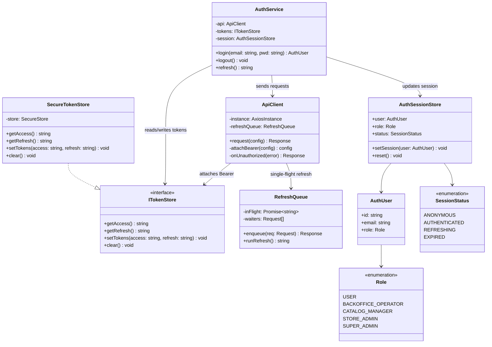
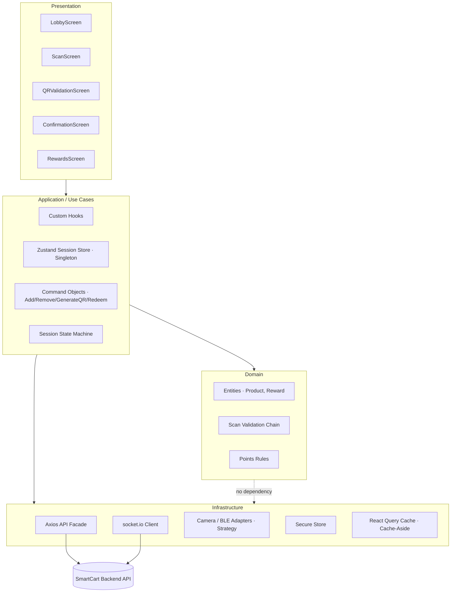

# UX Analysis

## Test Setup

- **Platform Used:** Maze | User Research and Testing Platform
- **Prototype Link:** [https://t.maze.co/542525865]
- **Prototype Scope:** Main onboarding, product scanning, QR checkout, and rewards redemption flow
- **Number of Participants:** 5

### Defined Tasks

| # | Task Description | Success Criteria |
|---|-----------------|-----------------|
| 1 | [Follow the normal flow of the application] | [Scan and complete list and reach the rewards screen] |

---

## Test Results

### Task 1 — [Follow the normal flow of the application]

| Participant | Outcome | Duration |
|-------------|---------|----------|
| [542985010]        | Success | [00:02:13] |
| [542830539]        | Success | [00:05:20] |
| [542990056]        | Success | [00:02:57] |
| [542985511]        | Fail | [00:01:52] |

---

## Heatmaps

### Lobby


### Scanning Flow


### Pending Items / QR Generation


### QR Validation


### Rewards


---

## Key Findings & Applied Corrections

| # | Finding / Problem Detected | Usability Dimension Affected | Correction Applied | Design Decision Justification |
|---|---------------------------|-----------------------------|--------------------|-------------------------------|
| 1 | Some screens give greater visual prominence to secondary actions over the intended primary action (P542990056). Correlates with P542985511's failure — this participant completed the flow in the shortest time but did not reach the goal, suggesting flow confusion rather than a readability issue. | Learnability / Visual Hierarchy | Increase the visual weight (size and color contrast) of the primary CTA on each screen; reduce the prominence of secondary controls so they do not compete with the priority action. | A clearly differentiated primary CTA reduces action ambiguity and guides the user toward the correct step in the Discover → Scan → Validate → Earn → Redeem loop without requiring exploration. |
| 2 | Users lack context about which step of the flow they are on and what action is expected from them at each screen (P542985010). | Learnability / Feedback | Add a lightweight progress indicator (e.g., "Step 2 of 3 — Scan your product") and contextual micro-copy on the key screens of the main flow. | Progress feedback aligns user expectations with the app flow, reduces navigation anxiety, and lowers the likelihood of drop-off at intermediate steps. |
| 3 | The interface presents too many visual elements simultaneously, creating a sense of overwhelm (P542830539). This participant had the highest completion time in the group (00:05:20 vs. avg ~00:02:47), directly supporting the efficiency impact. | Efficiency / Cognitive Load | Apply progressive disclosure: hide advanced or infrequent options until the user requests them; reduce the number of elements visible by default on high-density screens (lobby and product list). | Lowering information density per screen reduces cognitive load, speeds up decision-making, and improves the overall perception of product simplicity. |
| 4 | Positive finding: text legibility was rated as clear by participants (P542985511). This participant's task failure is attributed to visual hierarchy (finding #1), not typography. | N/A (positive validation) | No correction needed — retain the current typographic system. | Confirmed text clarity indicates that the font, size, and contrast decisions are appropriate for the use context. No adjustment required. |

# Frontend Design

## 1.1. Technology Stack

SmartCart is a **consumer-facing mobile app** whose core features — barcode scanning via the device camera, in-store presence detection (GPS/BLE beacons), QR generation at checkout, and push notifications on point credit — all require **native device APIs**. A native cross-platform stack is therefore the correct application type.

| Concern | Choice | Version | Justification |
|---------|--------|---------|---------------|
| **Application Type** | Native Mobile App (managed via Expo) | — | The Discover → Scan → Validate → Accumulate → Redeem loop depends on camera, BLE/GPS, QR rendering, and push — all native capabilities. A native app delivers the in-store performance and hardware access a PWA cannot reliably provide. |
| **Framework** | React Native (Expo SDK 52) | RN **0.76.6** / Expo SDK **52** | A single codebase targets both iOS and Android, halving cost for a consumer app aimed at supermarket shoppers. Expo SDK 52 bundles native modules (camera, secure storage, notifications) with guaranteed inter-compatibility and provides EAS Build/OTA updates. New Architecture (Fabric/TurboModules) is enabled by default for smooth camera/scan UI. |
| **UI Runtime** | React | **18.3.1** | The exact React version shipped and validated by Expo SDK 52 / RN 0.76.6. |
| **Language** | TypeScript | **5.3.3** | Static typing makes the session state machine, command objects, and DTOs (`ProductDTO`) safe to refactor. Version 5.3.3 is the version pinned by `jest-expo` 52 and RN 0.76.6 templates. |
| **State Management** | Zustand | **4.5.5** | Lightweight global store with no boilerplate — ideal for the single active shopping session (points total, pending items, session status). Its subscription model is the natural substrate for the **Observer** and **Singleton** patterns. Compatible with React 18.3.1. |
| **Server State / Data Fetching** | TanStack Query (React Query) | **5.59.16** | Implements the client side of the **Cache-Aside** product lookup (cached barcode → product), automatic retries, and request de-duplication. Decouples server cache from UI state. Works with React 18.3.1 and Axios. |
| **HTTP Client** | Axios | **1.7.7** | Request/response interceptors automate JWT attachment and silent token refresh, and centralize error mapping (the **Facade** over the backend API). |
| **Navigation** | Expo Router (on React Navigation 7) | **4.0.x** | File-based routing over RN screens (Lobby, Scan, QR, Confirmation, Rewards). Bundled with and compatible with Expo SDK 52. |
| **Barcode / Camera Scanning** | expo-camera | **16.0.x** | Provides the live camera feed and barcode recognition for `CameraStrategy`. Shipped with Expo SDK 52, so native compatibility is guaranteed. |
| **In-Store Presence** | expo-location + react-native-ble-plx | location **18.0.x** / ble-plx **3.2.1** | GPS + BLE beacon detection gates point accrual to "user inside affiliated store" (required by the location pill on Screens 1 & 2). ble-plx 3.2.1 supports RN 0.76 New Architecture. |
| **QR Rendering** | react-native-qrcode-svg + react-native-svg | qrcode-svg **6.3.2** / svg **15.8.0** | Renders the large checkout QR on Screen 5. `react-native-svg` 15.8.0 is the version vendored by Expo SDK 52. |
| **Real-time Validation Status** | socket.io-client | **4.8.0** | Pushes POS validation status to the `ValidatingState` screen so "Esperando validación…" flips to the Confirmation screen without manual polling. Falls back to interval polling. |
| **Push Notifications** | expo-notifications (FCM/APNs) | **0.29.x** | Fires the "Puntos acreditados" notification when the backend credits points. Shipped with Expo SDK 52. |
| **Forms & Validation** | React Hook Form + Zod | RHF **7.53.0** / Zod **3.23.8** | Validates the manual-barcode-entry fallback and auth forms. Zod schemas double as the runtime guard for API DTOs. Both compatible with React 18.3.1 / TS 5.3.3. |
| **Styling / Design Tokens** | NativeWind (Tailwind CSS) | NativeWind **4.1.x** / Tailwind **3.4.x** | Utility-first styling enforces the design tokens (color/spacing/typography) consistently across all 7 screens. NativeWind 4 requires RN ≥ 0.76 — aligned with our framework. |
| **Secure Storage** | expo-secure-store | **14.0.x** | Stores JWT access/refresh tokens in the iOS Keychain / Android Keystore (never `AsyncStorage`). Shipped with Expo SDK 52. |
| **Linting** | ESLint | **9.12.0** | Enforces code quality via flat config with the Expo/React Native preset. |
| **Formatting** | Prettier | **3.3.3** | Deterministic formatting; integrated with ESLint to avoid rule conflicts. |
| **Unit Testing** | Jest (jest-expo) | Jest **29.7.0** / jest-expo **52.0.x** | jest-expo 52 is the preset matched to Expo SDK 52 / RN 0.76.6. Covers utils, stores, commands, and validation handlers. |
| **Integration / UI Testing** | React Native Testing Library | **12.8.0** | Tests component interactions (scan confirmation modal, delete-with-undo, QR generation) on RN 0.76.6. |
| **E2E Testing** | Maestro | **1.39.x** | Flow-based E2E across real devices/simulators for the critical scan → checkout → redeem journey. Simpler than Detox for Expo-managed apps. |
| **Monitoring** | Sentry (sentry-expo) | **9.x** | Captures uncaught exceptions, performance traces, and crash reports in production. |
| **CI/CD** | GitHub Actions + EAS Build | — | GitHub Actions runs lint/test/build; EAS Build produces signed iOS/Android binaries and EAS Submit ships to the stores. |
| **Distribution / Hosting** | Expo EAS → Apple App Store + Google Play | — | Native app distribution channel; EAS Update delivers OTA JS patches between store releases. |

> **Compatibility statement:** The entire stack is anchored on **Expo SDK 52**, which pins React 18.3.1, React Native 0.76.6, react-native-svg 15.8.0, expo-camera 16, expo-notifications 0.29, and TypeScript 5.3.3 as a validated, mutually compatible set. Third-party libraries (Zustand 4.5.5, TanStack Query 5.59, Axios 1.7.7, NativeWind 4.1, RHF 7.53, Zod 3.23.8, ble-plx 3.2.1, socket.io-client 4.8) all declare support for React 18.3.1 and RN 0.76 New Architecture.

### Environments

| Environment | URL / Endpoint | Purpose |
|-------------|----------------|---------|
| Development | `http://localhost:8081` (Metro) → API `http://localhost:3000/api/v1` | Local development on simulator/Expo Go (dev client) |
| Staging | `https://api-staging.smartcart.app/api/v1` | QA and pre-release validation; internal EAS distribution build |
| Production | `https://api.smartcart.app/api/v1` | Live users; App Store / Play Store release |

---

## 1.2. UX / UI Analysis

### Usability Attributes

| Attribute | Target |
|-----------|--------|
| **Learnability** | A first-time shopper completes the scan → validate → redeem loop with no instructions, guided by one primary CTA per screen ("Escanear producto" → "Generar QR de salida" → "Ver mis recompensas"). |
| **Efficiency** | Scanning a product and adding it to the pending list takes ≤ 3 interactions: tap CTA → align barcode → confirm. |
| **Error Prevention** | After a scan, the app requires explicit confirmation of the detected product before adding it (prevents wrong-product accrual). Point accrual is blocked unless the location pill confirms the user is inside an affiliated store. |
| **Visibility of Status** | Current points, pending points (yellow tags), and the live QR validation state ("Esperando validación…") are always visible. The points card progress bar shows the deficit to the next reward. |
| **Confidence Feedback** | Green success toast on each scan ("+15 pts pendientes"), full-green confirmation hero with checkmark, and explicit warning/error messages for failed scans or expired QR. |
| **Consistency** | Uniform design tokens (color, spacing, typography) applied via NativeWind across all 7 screens; the green brand color signals "valid / earn points" everywhere. |
| **Error Recovery** | A failed camera scan offers retry or manual barcode entry without leaving the flow (**Strategy** pattern). A wrongly scanned item can be deleted before validation via the red X (**Command** pattern with undo). |
| **Accessibility** | WCAG 2.1 AA: contrast ≥ 4.5:1 (verified against the green palette), screen-reader labels on camera/QR/CTAs, scalable text, and non-color-only status cues (icons + text alongside green/yellow/red). |

### Branding & Style Guidelines

SmartCart's visual identity is **green-forward** — green communicates "valid scan / points earned" and dominates the checkout and confirmation screens for cashier visibility.

#### Color Palette

| Token | Hex | Usage |
|-------|-----|-------|
| `--color-primary` | `#16A34A` | Primary actions, CTAs ("Escanear", "Generar QR"), confirmation hero |
| `--color-secondary` | `#15803D` | Secondary green elements, pressed states, gradient base for featured reward |
| `--color-accent` | `#FACC15` | Pending-points tags, "Nuevo" highlights, badges |
| `--color-background` | `#F9FAFB` | App background |
| `--color-surface` | `#FFFFFF` | Cards, modals, product list rows |
| `--color-error` | `#DC2626` | Error states, delete (red X), expired QR |
| `--color-success` | `#22C55E` | Success toast, validated-product checkmarks |
| `--color-text-primary` | `#111827` | Main text |
| `--color-text-secondary` | `#6B7280` | Subtitles, captions, motivational subtitle |

#### Typography

| Role | Font Family | Weight | Size | Usage |
|------|-------------|--------|------|-------|
| Display / Heading | Poppins | 700 | 24px | Screen titles, points total |
| Subheading | Poppins | 600 | 18px | Section headers ("Productos con puntos hoy") |
| Body | Inter | 400 | 16px | General text, product names |
| Caption | Inter | 400 | 12px | Labels, hints, expiry dates, alphanumeric QR fallback |
| Button | Poppins | 600 | 14px | CTA text |

#### Spacing & Layout

| Token | Value | Usage |
|-------|-------|-------|
| `--spacing-xs` | 4px | Tight spacing (tag padding) |
| `--spacing-sm` | 8px | Internal component padding |
| `--spacing-md` | 16px | Default padding, card gaps |
| `--spacing-lg` | 24px | Section spacing |
| `--spacing-xl` | 32px | Screen-level padding |

- **Grid System:** Single-column, mobile-first stacked layout (one primary action per screen); 4pt spacing scale.
- **Breakpoints:** `sm: 375px` (baseline phone), `md: 768px` (large phones/tablet), `lg: 1024px` (tablet landscape).
- **Iconography:** Lucide React Native (`lucide-react-native` 0.4xx) — consistent outline set for nav, scan, flash, delete, rewards.
- **Logo Usage Rules:** Minimum 24px height; maintain clear space equal to the cart glyph height; never recolor outside the primary/secondary green or white-on-green.

### Core Business Process

#### Onboarding & Home (Lobby)
1. The user opens the app upon arriving at a store.
2. The system detects the user's presence in an affiliated store and enables point accumulation for the session.
3. The user reviews their current point balance, progress toward the next reward, and the day's sponsored products.
4. The user chooses to begin scanning or to review pending items from a prior moment in the session.

#### Product Scanning & Pending List
1. The user initiates scanning.
2. The system activates barcode capture (camera by default).
3. Alternatively, the user provides the barcode manually when the printed code is damaged.
4. Once a code is captured, the system retrieves the product details and asks the user to confirm the detected product.
5. Upon confirmation, the system validates that the user is in-store, the format is valid, the product is sponsored, and it is not already in the session, then adds it with its pending points.
6. The user may continue scanning or move toward checkout.

#### Checkout & Points Validation
1. With shopping complete, the user requests a checkout validation code.
2. The system issues a unique, time-limited (10-minute) code representing the pending items.
3. The user presents the code to the cashier.
4. The system waits for the store's confirmation of the purchase.
5. Upon confirmation, the system credits the corresponding points and informs the user that the purchase was verified.

#### Rewards Redemption
1. The user opens the rewards section.
2. The system shows the available point balance and the redeemable rewards, marking those still out of reach with the missing amount.
3. The user selects a reward and confirms spending the points.
4. The system deducts the points and issues a coupon ready to use.

### Wireframes

The interactive HTML prototypes referenced in `appContext.md` map to these screens:

| Screen | Prototype file | Purpose |
|--------|----------------|---------|
| 1 — Lobby (empty) | `pantalla-1-main-vacio.html` | Overview of points, sponsored products, primary scan CTA, location pill. |
| 2 — Camera Scanning | `pantalla-2-escanear.html` | Capture barcode via camera with manual-entry fallback and in-store confirmation. |
| 3 — Lobby (1 product) | `pantalla-3-main-1producto.html` | First scanned product with toast, pending-points subsection, delete option. |
| 4 — Lobby (multiple) | `pantalla-4-main-3productos.html` | Full pending list with dual CTAs (scan more / generate QR). |
| 5 — QR Validation | `pantalla-5-qr-validacion.html` | Full-green QR + alphanumeric fallback, 10-min validity, polling status. |
| 6 — Confirmation | `pantalla-6-confirmacion.html` | Points-credited hero, validated products, new total, paths to home or rewards. |
| 7 — My Rewards | `pantalla-7-recompensas.html` | Available rewards + redeemed coupons tabs; locked rewards show point deficit. |

### UX Test Results

- **Platform Used:** Maze (unmoderated remote) + in-person sessions with external design students.
- **Results Summary:** See the Phase 1 metrics table in `DesignTemplate.md` (≥ 4 participants × 4 tasks: register, scan, generate QR, redeem).
- **Key Findings (expected focus areas):** discoverability of the manual-entry fallback on the scan screen; clarity of the "pending vs credited" points distinction; one-tap QR generation satisfaction.
- **Corrections Integrated:** track each finding in the Phase 1 "Key Findings & Applied Corrections" table and reflect the applied fix in the final NativeWind component styles.

---

## 1.3. Component Design Strategy

#### Atoms — `/components/atoms/`

| Component | File | How to build it |
|-----------|------|-----------------|
| `Button` | [`/components/atoms/Button.tsx`](/frontend/src/components/atoms/Button.tsx) | Stateless `Pressable`; props `variant` (`'primary' \| 'secondary' \| 'ghost'`), `label`, `icon?`, `onPress`, `disabled?`. Maps `variant` → NativeWind token classes — the single source for the primary-vs-secondary CTA hierarchy (usability Finding #1). Sets `accessibilityRole="button"` + `accessibilityLabel`. |
| `Input` | [`/components/atoms/Input.tsx`](/frontend/src/components/atoms/Input.tsx) | Controlled wrapper over RN `TextInput`; props `value`, `onChangeText`, `error?`, `keyboardType?`. Driven by React Hook Form `Controller`; renders the Zod error message; `accessibilityLabel` required. Used by the manual-barcode fallback and auth forms. |
| `Icon` | [`/components/atoms/Icon.tsx`](/frontend/src/components/atoms/Icon.tsx) | Thin wrapper over `lucide-react-native`; props `name`, `size`, `color` (from tokens). Decorative icons set `accessibilityElementsHidden`; meaningful icons pair with text. |
| `Badge` | [`/components/atoms/Badge.tsx`](/frontend/src/components/atoms/Badge.tsx) | Small label pill; props `text`, `tone` (`'neutral' \| 'new'`). Renders the "Nuevo" tag on the latest scanned item. |
| `PointsTag` | [`/components/atoms/PointsTag.tsx`](/frontend/src/components/atoms/PointsTag.tsx) | Points pill; props `points`, `state` (`'pending' \| 'credited'`). Color **and** icon by state (accent for pending, success for credited) — never color alone (a11y). |
| `LocationPill` | [`/components/atoms/LocationPill.tsx`](/frontend/src/components/atoms/LocationPill.tsx) | Props `storeName`, `verified`. Dot + text; the visual gate that signals point accrual is enabled (user inside affiliated store). |
| `Toast` | [`/components/atoms/Toast.tsx`](/frontend/src/components/atoms/Toast.tsx) | Transient banner; props `message`, `tone` (`success \| warning \| error`), `visible`. Subscribes to the global notification slice (Observer), auto-dismisses, and sets `accessibilityLiveRegion="polite"`. |

#### Molecules — `/components/molecules/`

| Component | File | How to build it |
|-----------|------|-----------------|
| `ProductCard` | [`/components/molecules/ProductCard.tsx`](/frontend/src/components/molecules/ProductCard.tsx) | Composes `Icon` + `PointsTag` + delete `Button`; props `product: ProductDTO`, `isNew?`, `onDelete`. Wrapped in `React.memo`. Delete dispatches `RemoveProductCommand` (supports undo). |
| `PointsCard` | [`/components/molecules/PointsCard.tsx`](/frontend/src/components/molecules/PointsCard.tsx) | Points total + progress bar + pending subsection; props `total`, `pending`, `nextRewardAt`. Reads from the session store via a selective Zustand selector. |
| `ScanConfirmationModal` | [`/components/molecules/ScanConfirmationModal.tsx`](/frontend/src/components/molecules/ScanConfirmationModal.tsx) | Props `product`, `onConfirm`, `onCancel`. Focus is trapped; confirm is the primary CTA. Enforces error prevention — explicit confirmation before accrual. |
| `RewardCard` | [`/components/molecules/RewardCard.tsx`](/frontend/src/components/molecules/RewardCard.tsx) | Props `reward: RewardDTO`, `balance`, `onRedeem`. Locked state shows the point deficit; redeem `Button` is disabled when `balance < reward.cost`. |
| `QRCodeView` | [`/components/molecules/QRCodeView.tsx`](/frontend/src/components/molecules/QRCodeView.tsx) | Wraps `react-native-qrcode-svg`; props `token`, `expiresAt`. Renders the alphanumeric fallback code and a countdown to the 10-minute expiry. |

#### Organisms — `/components/organisms/`

| Component | File | How to build it |
|-----------|------|-----------------|
| `BottomNav` | [`/components/organisms/BottomNav.tsx`](/frontend/src/components/organisms/BottomNav.tsx) | Tab bar (Home/Scan/Rewards/Profile); props `active`. Each tab sets `accessibilityRole="tab"`; navigation via Expo Router. |
| `PendingItemsList` | [`/components/organisms/PendingItemsList.tsx`](/frontend/src/components/organisms/PendingItemsList.tsx) | `FlashList` of `ProductCard`; props `items`, `onDelete`. Empty list renders the dashed empty-state card. |
| `SponsoredCarousel` | [`/components/organisms/SponsoredCarousel.tsx`](/frontend/src/components/organisms/SponsoredCarousel.tsx) | Horizontal list of sponsored cards; props `products`, `onSeeAll`. Implements the "Ver todos" progressive-disclosure affordance (usability Finding #3). |
| `RewardsCatalog` | [`/components/organisms/RewardsCatalog.tsx`](/frontend/src/components/organisms/RewardsCatalog.tsx) | Tabs ("Disponibles" / "Mis cupones") wrapping a list of `RewardCard` and `CouponsList`; props `rewards`, `coupons`, `balance`. |
| `CouponsList` | [`/components/organisms/CouponsList.tsx`](/frontend/src/components/organisms/CouponsList.tsx) | `FlashList` of redeemed coupons ready to use; props `coupons`. |

#### Product decorators — `/components/product/decorators/`

`SponsoredProductDecorator`, `NewlyScannedDecorator`, `ValidatedProductDecorator`, `LockedRewardDecorator` wrap a base card to add a visual state (badge / green highlight / check / lock) **without** modifying it (Decorator pattern). They are stacked per screen context — e.g. a sponsored + newly-scanned item composes two decorators.

#### Templates / Screens — `/app/`

| Screen component | Route file | How to build it |
|------------------|-----------|-----------------|
| `LobbyScreen` | [`/app/index.tsx`](/frontend/app/index.tsx) | Container: calls `useSession`, composes `PointsCard` + `SponsoredCarousel` + `PendingItemsList` + `BottomNav`. |
| `ScanScreen` | [`/app/scan.tsx`](/frontend/app/scan.tsx) | Container: calls `useScan` (Strategy: camera/manual), mounts the camera, renders `ScanConfirmationModal`. |
| `QRValidationScreen` | [`/app/checkout.tsx`](/frontend/app/checkout.tsx) | Container: calls the checkout hook (socket/poll), renders `QRCodeView` + waiting status. |
| `ConfirmationScreen` | [`/app/confirmation.tsx`](/frontend/app/confirmation.tsx) | Container: renders the credited-points hero, validated list, and home/rewards CTAs. |
| `RewardsScreen` | [`/app/rewards.tsx`](/frontend/app/rewards.tsx) | Container: calls `useRewards`, composes `RewardsCatalog`. |

Screens are **containers**: they own data/state (hooks + stores), compose organisms, and pass plain props down. Presentational children hold no business logic (Container/Presentational split).

---

## 1.4. Security

The authentication, session, and authorization classes are modeled below; the
`Authentication`, `Session Management`, and `Authorization (RBAC)` subsections
each reference it.



### Authentication

> **Implemented by** `AuthService` + the `ApiClient` Axios **Facade** (see the class diagram above). Concrete code: the Axios Singleton in [`/frontend/src/api/client.ts`](/frontend/src/api/client.ts), auth endpoints in [`/frontend/src/api/endpoints/auth.ts`](/frontend/src/api/endpoints/auth.ts), and the [`useAuth`](/frontend/src/hooks/useAuth.ts) hook.

- **Provider / Method:** JWT (access + refresh) issued by the SmartCart backend.
- **Flow:**
  1. User submits email + password (validated client-side with Zod).
  2. Backend validates credentials and returns an access token (short-lived) and a refresh token.
  3. Frontend stores both tokens in **expo-secure-store** (Keychain/Keystore) — never in `AsyncStorage`.
  4. The Axios request interceptor attaches `Authorization: Bearer <access>` to every protected request.
  5. On a `401`, the response interceptor uses the refresh token to obtain a new access token once, then retries the original request; concurrent requests queue behind a single refresh.

### Authorization (RBAC)

> **Maps to the `Role` enum in the class diagram above.** RBAC is enforced **server-side** in the API middleware (per `designPatterns.md` guideline #6 — "el `ReviewController` requiere autenticación con rol `BACKOFFICE_OPERATOR` o superior"). The mobile client trusts the `role` claim **only to hide/show UI**, never to grant access.

This **consumer mobile app only ever authenticates `USER`-scoped accounts** — it never issues a privileged token. The back office is a **separate web tool** and, importantly, is **not staffed only by admins**: it has several distinct non-admin operational roles. All roles are documented here because RBAC is a shared, server-enforced concern.

| Role | Surface | Key permissions |
|------|---------|-----------------|
| `USER` | **This mobile app** | Scan products, manage pending session, generate checkout QR, browse/redeem rewards, view own points history |
| `BACKOFFICE_OPERATOR` | Back-office fraud dashboard | Review the HITL queue: approve/reject high-risk `ReviewItem`s coming from the `FraudDetectionAgent`. **Cannot** review a session they are party to (segregation of duties). No catalog or user-management rights. |
| `CATALOG_MANAGER` | Back-office | Manage the product catalog & sponsored list, edit daily promotions, trigger `ProductCacheService.invalidateAllPromotions()`. No fraud-review or user-management rights. |
| `STORE_ADMIN` | Back-office | Per-store analytics, rewards-catalog configuration, monitor validations for their store(s). No global user management. |
| `SUPER_ADMIN` | Back-office | User & role management, cross-store administration, configure fraud-risk thresholds. Full back-office authority. |

> The high-stakes **AI Fraud Detection** human-review flow (`designPatterns.md`) is operated by `BACKOFFICE_OPERATOR` (and escalated to `SUPER_ADMIN`) **in the back-office tool, not in this consumer app**.

### Session Management

> **See the class diagram at the top of §1.4** — session state lives in `AuthSessionStore` (`SessionStatus`: `ANONYMOUS → AUTHENTICATED → REFRESHING → EXPIRED`); tokens live in `SecureTokenStore`; refresh is orchestrated by `ApiClient` + `RefreshQueue`.

- **Token Expiry:** Access token **15 min** / Refresh token **7 days**. On access-token expiry the `ApiClient` response interceptor transitions `AuthSessionStore.status` to `REFRESHING`.
- **Refresh Strategy:** Silent refresh handled by `ApiClient.onUnauthorized()` on `401`. `RefreshQueue` guarantees a **single in-flight refresh** (`runRefresh()`): concurrent requests are queued behind one promise and replayed once a new access token arrives. If the **refresh request itself returns `401`** (refresh token expired/revoked), the queue rejects all waiters and triggers a **hard logout** (`status → EXPIRED`).
- **Storage Decision:** `SecureTokenStore` wraps `expo-secure-store` (hardware-backed Keychain/Keystore) instead of `AsyncStorage`/`localStorage`, because tokens are sensitive and `AsyncStorage` is unencrypted on device. `ITokenStore` is the injected interface, so the store is mockable in tests.
- **Logout Behavior:** `SecureTokenStore.clear()` wipes both tokens; the refresh token is revoked **server-side**; `AuthSessionStore.reset()` returns status to `ANONYMOUS`; the React Query cache is cleared to drop any user-scoped data.

### Secure Configuration

- **Environment Variables:** Managed per environment via `app.config.ts` `extra` + EAS environment variables; only non-secret, public config (API base URL) is bundled. No secrets committed to VCS.
- **Secret Management Platform:** EAS Secrets for build-time values; the mobile client holds **no** server secrets (POS/B2B API keys live exclusively in the backend).

### OWASP Compliance

We follow the **OWASP Mobile Application Security** project — **MASVS v2.1** (verification standard) backed by the **MASTG** testing guide — because SmartCart is a native React Native app, where mobile-specific threats (insecure on-device storage, reverse engineering, platform IPC) matter far more than the web-only OWASP Top 10. The table states the **concrete control the team will implement** for each MASVS group:

| MASVS control group | What we will do |
|---------------------|-----------------|
| **MASVS-STORAGE** (data storage) | Store access/refresh tokens **only** in Keychain/Keystore via `SecureTokenStore`; never in `AsyncStorage`; no PII written to logs or analytics |
| **MASVS-CRYPTO** (cryptography) | Rely on platform-provided crypto (secure-store, TLS); **no hand-rolled crypto**; no secrets shipped in the bundle (EAS Secrets only) |
| **MASVS-NETWORK** (network comms) | HTTPS-only with TLS 1.2+; iOS ATS / Android cleartext **disabled**; optional certificate pinning on the API host |
| **MASVS-AUTH** (authentication) | Short-lived JWT + server-side refresh revocation; server-enforced **RBAC** (see Authorization above); biometric re-auth as a future option |
| **MASVS-PLATFORM** (platform interaction) | Validate **all** input with Zod (manual barcode + auth forms) to block injection; request **least-privilege** native permissions (camera/location) only when needed; no sensitive data in screenshots/`pasteboard` |
| **MASVS-CODE** (code quality) | Pinned dependencies + `npm audit` / SCA gate in CI; Zod runtime guards on every API DTO; IDOR prevented by server-side per-token authorization (client never trusts raw IDs) |
| **MASVS-RESILIENCE** (anti-tampering) | Production builds strip `console.*`; release builds use **Hermes bytecode**; Sentry monitors anomalies; optional jailbreak/root detection signal |

> **On web XSS:** the rubric (`Caso2.md` §3.2.3) cites XSS as an OWASP example. Classic DOM-based XSS does **not** apply to React Native (there is no HTML DOM / `innerHTML`); the equivalent injection risk — untrusted barcode/form input reaching the API — is covered under **MASVS-PLATFORM** and **MASVS-CODE** via Zod validation.
---

## 1.5. Layered Architecture

- **Architectural Pattern:** **Clean Architecture adapted to React Native** with a Feature-Sliced layout — the UI depends inward on use-cases, which depend on the domain; infrastructure is injected behind interfaces.
- **Layer Responsibilities:**

| Layer | Responsibility | Examples |
|-------|---------------|----------|
| Presentation | Render UI, handle gestures/events | Screens, atoms/molecules/organisms |
| Application / Use Cases | Orchestrate business logic | Custom hooks, Zustand stores, **Command** objects, session **State** machine |
| Domain | Core business rules & entities | `Product`/`ProductDTO`, session states, scan-validation handlers, points rules |
| Infrastructure | External communication & device APIs | Axios client (**Facade**), socket.io client, secure-store, camera/BLE adapters |

- **Layer Access Rules:** Presentation may call only the Application layer (hooks/stores). Application may call Domain and Infrastructure (the latter only through interfaces). **Domain must not import Infrastructure or React** — it stays pure and unit-testable.

- **Diagram:**



---

## 1.6. Design Patterns

Mapped directly from `designPatterns.md` to their frontend implementation locations.

### Asynchronous Operations

- **Approach:** `async/await` with Axios, wrapped by TanStack Query for caching/retries/de-duplication.
- **Loading States:** Skeleton placeholders for the sponsored carousel and rewards catalog; an animated scan line signals active barcode processing.
- **Error Boundaries:** A React Error Boundary per feature (`scan`, `checkout`, `rewards`) prevents a single failure from crashing the app.
- **Retry Logic:** Automatic retry on network/5xx with exponential backoff (max 3 attempts) for idempotent reads; **non-idempotent** actions (QR generation, redemption) are **not** auto-retried.
- **WebSocket Usage:** While in `ValidatingState`, the client joins socket.io room `session:{id}` to receive the POS validation result and auto-transition to the Confirmation screen; if the socket drops, it falls back to polling `GET /sessions/:id` every 3 s until the 10-minute QR expiry.
- **Long-Running Processes:** Checkout validation may pause for AI fraud review (human-in-the-loop, ≤ 2 min). The screen shows a "Verificando…" status and never blocks indefinitely — it resolves on push/socket or on the expiry/timeout signal.

### Error Handling & Observability

- **Global Error Handler:** The Axios response interceptor catches all API errors and dispatches user-friendly messages to a global notification slice.
- **User-Facing Error Messages:** HTTP codes are mapped to friendly Spanish copy (e.g., expired QR → "El código expiró, genéralo de nuevo"; out-of-store scan → "Acércate a una tienda afiliada para sumar puntos").
- **Frontend Monitoring:** Sentry captures uncaught exceptions and performance traces, tagged with screen and session state.
- **Logging:** `console.*` stripped from production via Babel plugin; errors are forwarded to Sentry only.

---

## 1.7. Performance

| Strategy | Implementation |
|----------|---------------|
| **Lazy Loading** | Expo Router lazy-loads route screens; the camera module mounts only on the Scan screen to keep startup fast. |
| **Code Splitting** | Metro inline requires + route-level splitting; heavy modules (camera, QR/SVG) load on demand. |
| **Bundle Optimization** | Hermes engine with bytecode precompilation, tree-shaking, and dead-code elimination in production EAS builds. |
| **Image Optimization** | `expo-image` with disk/memory caching and `contentFit`; sponsored-product images served as WebP at device-appropriate resolution. |
| **Memoization** | `React.memo` on `ProductCard`/`RewardCard`; `useMemo`/`useCallback` for pending-points totals and list renderers; selective Zustand selectors to avoid over-rendering. |
| **Virtualization** | `FlashList` (Shopify, 1.7.x) for the rewards catalog and pending list, keeping scroll smooth as item counts grow. |
| **Caching** | TanStack Query caches product lookups and rewards (Cache-Aside); EAS Update delivers OTA JS without a full store release. |

---

## 1.8. Testing Strategy

| Level | Tool | Scope | Min. Coverage |
|-------|------|-------|---------------|
| **Unit** | Jest 29.7.0 (jest-expo 52) | Session store, command objects (incl. undo), scan-validation chain, points rules, utils | 80% |
| **Integration** | React Native Testing Library 12.8.0 | Scan-confirm modal, delete-with-undo, QR generation, manual-entry fallback, reward redemption | 70% |
| **UI / E2E** | Maestro 1.39.x | Critical flows: register → scan → generate QR → confirm → redeem | Key flows 100% |
| **Accessibility** | `@axe-core/react` + manual VoiceOver/TalkBack passes | WCAG 2.1 AA on all interactive screens | 0 critical violations |

---

## 1.9. CI/CD Pipeline (Frontend)

```
[Trigger: Push to PR / main branch]
        │
        ▼
┌─────────────────────────┐
│  1. Install & Cache Deps │
└────────────┬────────────┘
             ▼
┌─────────────────────────┐
│  2. Lint (ESLint 9)      │
└────────────┬────────────┘
             ▼
┌─────────────────────────┐
│  3. Format Check         │
│     (Prettier 3)         │
└────────────┬────────────┘
             ▼
┌─────────────────────────┐
│  4. Type Check (tsc)     │
└────────────┬────────────┘
             ▼
┌─────────────────────────┐
│  5. Unit & Integration   │
│     Tests (Jest / RTL)   │
└────────────┬────────────┘
             ▼
┌─────────────────────────┐
│  6. EAS Build (iOS/And.) │
└────────────┬────────────┘
             ▼
┌─────────────────────────┐
│  7. E2E Tests (Maestro)  │
└────────────┬────────────┘
             ▼
┌─────────────────────────┐
│  8. Deploy: EAS Update   │
│  (staging) → Submit (prod)│
└─────────────────────────┘
```

- **Tooling:** GitHub Actions for lint/type/test; `expo/expo-github-action` + EAS Build/Submit for binaries and store submission.
- **Branch Strategy:** GitHub Flow — feature branches → PR → `main`.
- **Quality Gates:** A PR cannot merge if lint, type check, tests, or build fail; minimum coverage thresholds enforced.
- **Deployment Strategy:** Merge to `main` → automatic **EAS Update** to the staging channel; manual promotion (EAS Submit) to production store tracks after QA sign-off.

---

## 1.10. Project Scaffold

- **Root:** `/src` (Expo Router routes in `/app`)

```
/src
├── /api/                  # API Facade + Cache-Aside
│   ├── client.ts          # Axios instance: interceptors, JWT refresh (Singleton)
│   └── /endpoints/        # products.ts, sessions.ts, rewards.ts, auth.ts, validation.ts
├── /assets/               # Images, fonts (Poppins, Inter), icons
├── /components/           # Reusable UI (Atomic Design)
│   ├── /atoms/            # Button, Input, Badge, PointsTag, LocationPill, Toast
│   ├── /molecules/        # ProductCard, PointsCard, ScanConfirmationModal, RewardCard, QRCodeView
│   ├── /organisms/        # BottomNav, PendingItemsList, SponsoredCarousel, RewardsCatalog
│   └── /product/decorators/  # Sponsored/NewlyScanned/Validated/LockedReward (Decorator)
├── /features/             # Feature logic & local state
│   ├── /scan/             # scannerService.ts, /strategies/ (Camera, Manual), /validation/ (CoR chain)
│   ├── /session/          # /states/ (State machine), /commands/ (Command + undo)
│   ├── /checkout/         # QR generation + validation status (WebSocket/polling)
│   └── /rewards/          # /factories/ (RewardFactory), redemption hooks
├── /hooks/                # useSession, useScan, useRewards, useAuth
├── /lib/                  # utils, constants, /i18n/ (es-CR, en)
├── /store/                # Zustand stores (sessionStore = Singleton), slices
├── /styles/               # NativeWind theme, design tokens
└── /types/                # Shared TS types & DTOs (ProductDTO, RewardDTO, SessionDTO)

/app                       # Expo Router screens
├── _layout.tsx            # Root nav + providers (Query, SafeArea, ErrorBoundary)
├── index.tsx              # Lobby
├── scan.tsx               # Camera scanning
├── checkout.tsx           # QR validation
├── confirmation.tsx       # Points credited
└── rewards.tsx            # Rewards & coupons
```
